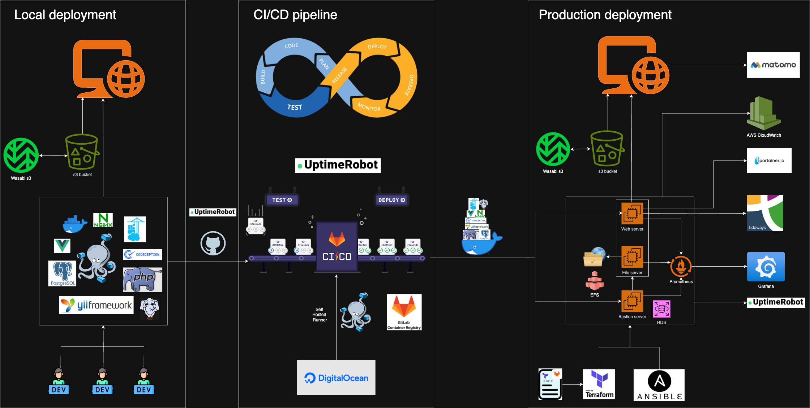

# Documentation of GigaDB Infrastructure and Deployment Flow Monitoring

### Overview

This document focuses specifically on the monitoring aspects of the GigaDB infrastructure and its deployment workflow, 
detailing the tools and processes used to ensure system health and performance across three core stages: Local, CI/CD, and Production.

### Local infrastructure and Deployment Monitoring

Provide developers with a consistent local environment for coding, testing, and initial containerization, while integrating with cloud storage for asset management.

##### Core Components
| Category             | Tools                    | Functions                                                                                |
|----------------------|--------------------------|------------------------------------------------------------------------------------------|
| Storage              | Wasabi S3, AWS S3 bucket | Storage and backup                                                                       | 
| Containerization     | Docker                   | Package the application and its dependencies into portable containers                    |
| Orchestration        | Docker Compose           | Define and run multi-container Docker applications                                       |
| Frontend             | Vue.js                   | Build frontend logic, serve traffic, store data, and run automated tests                 |
| Backend              | Yii Framework            | PHP framework for building web applications, manage routing, and handle requests         |
| Programming language | PHP                      | Develop backend logic and handle server-side operations                                  |
| Web server           | Nginx                    | Serve up website, reverse proxy to backend services                                      |
| Database             | PostgreSQL               | Store dataset information                                                                |
| Testing framework    | Codeception              | Run automated tests to validate code changes                                             |
| Version control      | GitHub                   | Store and manage codebase, track changes, trigger CI/CD, and collaborate with developers |

##### Workflow

1. Developers use the local stack to build features.
2. Codeception runs automated tests to validate code changes.
3. Docker packages the app and its dependencies into a container.
4. Metadata are stored in Wasabi S3/S3 buckets for testing.
5. Code is pushed to GitHub, then triggering the CI/CD pipeline.

### CI/CD Pipeline (Automated Testing & Deployment) Monitoring

Automate code validation, testing, and Docker image publishing to ensure quality and readiness for production.

##### Core Components

| Category           | Tools          | 	Functions                                                                                                                   |
|--------------------|----------------|------------------------------------------------------------------------------------------------------------------------------|
| Container Registry | GitLab 	       | Store and version Docker images built during the pipeline                                                                    |
| Pipeline runner    | Self - Hosted  | Run CI/CD jobs (e.g., testing, image building)                                                                               |
| Runner             | Digital Ocean  | Provide compute resources for self - hosted runners and pipeline operations                                                  |
| Pipeline Triggers  | GitHub         | Trigger CI/CD pipeline on code changes                                                                                       |
| Containerization   | Docker	        | Build and publish production - ready images                                                                                  |
| Orchestration      | Docker Compose | Define multi-container applications for testing and deployment                                                               |
| Testing Framework  | Codeception    | Run automated tests to validate code changes                                                                                 |
| Monitoring         | UptimeRobot	   | External monitoring of the CI/CD environment, ensuring that the pipeline infrastructure itself is operational and responsive |

##### Workflow

1. Code Push Trigger: A code push to the repository (e.g., GitHub) triggers the GitLab CI/CD pipeline.
2. Conformance and security checks: The pipeline runs conformance and security checks to ensure code quality.
2. Test Stage: Self-hosted runners execute automated tests (e.g., unit_func_tests, integration_tests, api_tests, legacy_tests).
3. Build & Publish: If tests pass, the pipeline builds Docker images and pushes them to the GitLab Container Registry.
4. Deployment: The images will be shipped to production servers for deployment.

### Production infrastructure and Deployment Monitoring

Run the application securely at scale, with monitoring, configuration management, and integration with third-party services.

##### Core Components
| Category          | Tools                                                                     | Functions                                                                                   |
|-------------------|---------------------------------------------------------------------------|---------------------------------------------------------------------------------------------|
| Storage           | Wasabi S3, S3 bucket, EFS (Elastic File System)	                          | Store production assets (Wasabi/S3) and shared files (EFS).                                 | 
| Containerization	 | Docker	Run production-grade containers (ensures parity with development). |                                                                                             |
| Containers        | Built and shipped from GitLab                                             |                                                                                             |
| Monitoring	       | Prometheus                                                                | Collect and store system/application metrics (e.g., server CPU, app response time)          |
|                   | Grafana                                                                   | Visualize metrics via customizable dashboards                                               |
|                   | Matomo                                                                    | Tracks user interactions, website traffic, and behavior for analytic                        |
|                   | Portainer                                                                 | Provides a web-based UI for managing Docker containers (deployment, scaling, health checks) |
|                   | Tideaways                                                                 | Performance profiling and monitoring, error tracking, alerts and notification,              |
|                   | UptimeRobot                                                               | Uptime and responsiveness monitoring                                                        |
| IaC               | Terraform                                                                 | Define infrastructure                                                                       |
|                   | GitLab - Terraform state                                                  | Manage infrastructure as code (IaC) for consistent environment provisioning                 |
|                   | GitLab - Container Registry                                               | Store and version Docker images built during the pipeline                                   |
|                   | Ansible                                                                   | Automate configuration                                                                      |

##### Workflow

1. Infrastructure Provisioning (IaC):

Terraform defines and deploys cloud resources (Web Server, Bastion Server, File Server, networking, etc.).
Configuration Management:

Ansible configures servers (e.g., installs dependencies, sets up security policies).

2. Deploy Container Image:

Docker pulls the pre - built image from GitLab Container Registry and deploys it to the Web Server.

3. Storage & Security:

Wasabi S3 / S3 buckets host production assets.
Bastion Server restricts access to production resources (e.g., via SSH jump box).
File Server uses EFS for shared, persistent file storage.

4. Monitoring:

Prometheus scrapes metrics from services (Web Server, databases, etc.).
Grafana visualizes metrics in dashboards for performance monitoring (e.g., latency, error rates).
UptimeRobot monitors application uptime (alerts if the Web Server or critical services become unreachable).
Portainer.io tracks Docker container health (e.g., restart loops, resource limits).

### Summary

1. Local Development → Developers code, test, and containerize locally; push code to GitHub.
2. CI/CD Automation → GitLab CI/CD runs tests, builds/publishes Docker images to the GitLabregistry.
3. Production Infrastructure Setup → Terraform provisions resources based on the stored state file from GitLab; Ansible configures environments.
4. Live Deployment → Docker ships the image to the production servers and spins up the application and services.
5. Post-Deployment → Teams use Portainer (containers), Grafana (monitoring), and Matomo (analytics) to manage and optimize.