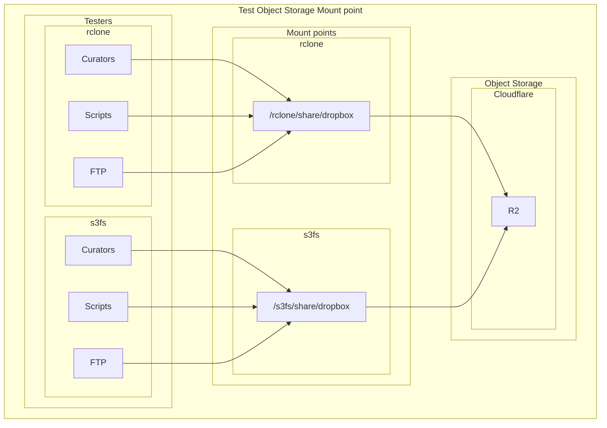

# Object Storage Mounting Guide

This document provides background information of rclone mount and s3fs mount, and a detailed guide to mount object storage on remote servers.

### Background

1. s3fs vs. rclone mount: Key Differences & Recommendations


| Feature	          | s3fs                                                                                                    | rclone mount                                                                                                     | 	Recommendation                        |
|:------------------|:--------------------------------------------------------------------------------------------------------|:-----------------------------------------------------------------------------------------------------------------|:---------------------------------------|
| Architecture      | 	FUSE-based, translates POSIX calls to S3 API. Strict POSIX emulation (e.g., file locking, permissions) | Uses virtual filesystem (VFS) layer. Prioritizes performance over strict POSIX compliance                        | 	rclone for performance                | 
| Performance       | 	Moderate (high metadata overhead), struggles with small-file operations                                | 	Generally higher throughput, especially for large files                                                         | 	rclone (10x+ speed in sequential ops) |
| Caching           | 	Supports local caching, but can be less efficient for large datasets                                   | 	Highly configurable VFS cache (--vfs-cache-mode) for reads and writes                                           | 	rclone for better caching             |
| POSIX Compliance  | 	High (supports permissions, ownership)                                                                 | 	Limited (e.g., no chmod/chown)                                                                                  | 	s3fs if strict POSIX required         | 
| Use Cases         | 	Legacy apps needing filesystem semantics                                                               | 	Bulk data xfer, read-heavy workloads                                                                            | 	rclone for R2-centric pipelines       | 
| Resource Usage    | 	Can be resource-intensive with many small files                                                        | 	Can use more memory, especially with a large VFS cache                                                          | 	rclone for resource efficiency        |
| Scalability       | 	Risk of hangs with heavy metadata ops                                                                  | More resilient for large-file I/O                                                                                | rclone for scalability                 | 
| Compatibility     | 	Works with most S3-compatible services                                                                 | 	Supports over 70 cloud providers, including R2                                                                  | 	rclone for broader compatibility      |
| Installation      | 	Easy to install, but may require additional dependencies                                               | 	Requires rclone installation, but straightforward setup                                                         | 	rclone for ease of use                |
| Community Support | 	Active community, but less frequent updates                                                            | 	Large community, frequent updates, and extensive documentation                                                  | 	rclone for active support             |

Bottom Line: For general-purpose mounting of an R2 bucket, rclone mount is often the better choice due to its superior performance, advanced caching capabilities, and active development.

### Mount Object Storage, eg. R2 Bucket

#### Prerequisites

- Ensure you have access to a Cloudflare R2 bucket and the necessary credentials (Access Key ID and Secret Access Key) and the endpoint URL.
- Ensure you have `s3fs` or `rclone` installed on your system.
- if not root mounting, will get error: `fusermount: option allow_other only allowed if 'user_allow_other' is set in /etc/fuse.conf`, can be fixed by:
```
[ec2-user@ip-10-99-0-232 ~]$ sudo vi /etc/fuse.conf
# Uncomment the following line
#user_allow_other
```
- For `s3fs`, you need to create a password file with your R2 credentials.
```
[ec2-user@ip-10-99-0-232 ~]$ echo $r2-access-key-id:$r2-secret-access-key > ~/.passwd_file
[ec2-user@ip-10-99-0-232 ~]$ chmod 600 ~/.passwd_file
```
- For `rclone`, you need to configure a remote pointing to your R2 bucket.
 

#### s3fs Mount

```
[ec2-user@ip-10-99-0-232 ~]$ s3fs test-gigadb-dropbox /s3fs \
-o passwd_file=~/.passwd_file \
-o url=https://$account-id.r2.cloudflarestorage.com \
-o allow_other \
-o use_cache=/tmp/cache/s3fs \
-o max_stat_cache_size=100000 \
-o multipart_size=128 \
-o umask=000 \
-o sigv4 \
-o logfile=/var/log/gigadb/s3fs-r2.log
```

-o passwd_file: Specifies the file containing your R2 credentials.
-o url: Crucially, sets the endpoint to your Cloudflare R2 account.
-o use_cache: Enables local caching of files in the specified directory.
-o max_stat_cache_size: Increases the size of the metadata stat cache to speed up lookups.
-o endpoint=auto: Required for R2
-o max_concurrent_requests=100: Increase concurrency
-o multipart_size=128: Better for large files

#### rclone Mount

```
[ec2-user@ip-10-99-0-232 ~]$ rclone mount r2:$your-bucket /rclone \
--daemon \
--cache-dir /var/cache/rclone \
--vfs-cache-mode full \
--vfs-cache-max-size 10G \
--vfs-read-chunk-size 32M \
--vfs-read-chunk-size-limit 2G \
--buffer-size 32M \
--allow-other \
--log-file /var/log/gigadb/rclone-r2.log \
--log-level INFO
```

--allow-other: Allows other users on the system to access the mount.
--daemon: Runs the mount process in the background.
--vfs-cache-mode full: enable read/write caching.
--vfs-cache-mode writes: Safe write buffering for uploads.
--vfs-cache-max-size: Sets a limit on the local cache size (adjust based on available disk space).
--vfs-read-chunk-size / --buffer-size: These flags can be tuned to increase read throughput by fetching larger chunks at a time, improve sequential read.
--vfs-read-ahead 1G: Prefetch large files
--log-file: Logs output to a file for easier debugging.

#### Mount points checking

```
[ec2-user@ip-10-99-0-232 ~]$ df -h | grep s3fs
s3fs                     64P     0   64P   0% /s3fs
[ec2-user@ip-10-99-0-232 ~]$ mount | grep s3fs
s3fs on /s3fs type fuse.s3fs (rw,nosuid,nodev,relatime,user_id=1000,group_id=1000,default_permissions,allow_other)
[ec2-user@ip-10-99-0-232 ~]$ ls -al /s3fs/share/dropbox/user5/
total 15
drwxr-xr-x. 1 ec2-user ec2-user 4096 Jun  6 04:09 .
drwxr-xr-x. 1 ec2-user ec2-user 4096 Jun  6 06:47 ..
-rw-r--r--. 1 ec2-user ec2-user   25 Jun  6 06:32 102498.filesizes
-rw-r--r--. 1 ec2-user ec2-user   54 Jun  6 06:32 102498.md5
-rw-r--r--. 1 root     root     5128 Jun  6 06:29 readme_102498.txt
[ec2-user@ip-10-99-0-232 ~]$ 
[ec2-user@ip-10-99-0-232 ~]$ df -h | grep rclone
r2:test-gigadb-dropbox  1.0P     0  1.0P   0% /rclone
[ec2-user@ip-10-99-0-232 ~]$ mount | grep rclone
r2:test-gigadb-dropbox on /rclone type fuse.rclone (rw,nosuid,nodev,relatime,user_id=1000,group_id=1000,allow_other)
[ec2-user@ip-10-99-0-232 ~]$ ls -al /rclone/share/dropbox/user5/
total 7
drwxr-xr-x. 1 ec2-user ec2-user    0 Jun 11 04:21 .
drwxr-xr-x. 1 ec2-user ec2-user    0 Jun 11 04:21 ..
-rw-r--r--. 1 ec2-user ec2-user   25 Jun  6 06:32 102498.filesizes
-rw-r--r--. 1 ec2-user ec2-user   54 Jun  6 06:32 102498.md5
-rw-r--r--. 1 ec2-user ec2-user 5128 Jun  6 06:29 readme_102498.txt
[ec2-user@ip-10-99-0-232 ~]$ 

```


### Performance and Benchmarks

|                                                | Command                                                                                                                                                                                 | s3fs mount                     | rclone mount                    |
|:-----------------------------------------------|:----------------------------------------------------------------------------------------------------------------------------------------------------------------------------------------|:-------------------------------|:--------------------------------|
| Large File Throughput (Write)                  | dd if=/rclone/share/dropbox/user999/rclone-test-write.dat of=/dev/null bs=1G count=4; dd if=/dev/zero of=/rclone/share/dropbox/user999/rclone-test-write.dat bs=1G count=4 oflag=direct | 6.052 s, 7.3 MB/s, %CPU: 10-30 | 586.052 s, 7.3 MB/s, %CPU: 7    |  
| Large File Throughput (Read)                   |                                                                                                                                                                                         |                                |                                 |
| Many Small Files (Metadata and I/O Operations) |                                                                                                                                                                                         |                                |                                 |
| Random Read/Write IOPS                         |                                                                                                                                                                                         |                                |                                 |


### Testing and Validation



### References
- [s3fs-fuse](https://github.com/s3fs-fuse/s3fs-fuse)
- [rclone mount](https://rclone.org/commands/rclone_mount)
- Example s3fs [mount command](https://community.hetzner.com/tutorials/object-storage-based-filesystem)
- Example rclone [mount command](https://forum.rclone.org/t/recommend-mount-settings-for-cloudflare-r2/38001)
- Cloudflare R2 [documentation](https://developers.cloudflare.com/r2/)
- Cloudflare R2 configuration with [rclone](https://developers.cloudflare.com/r2/examples/rclone/)