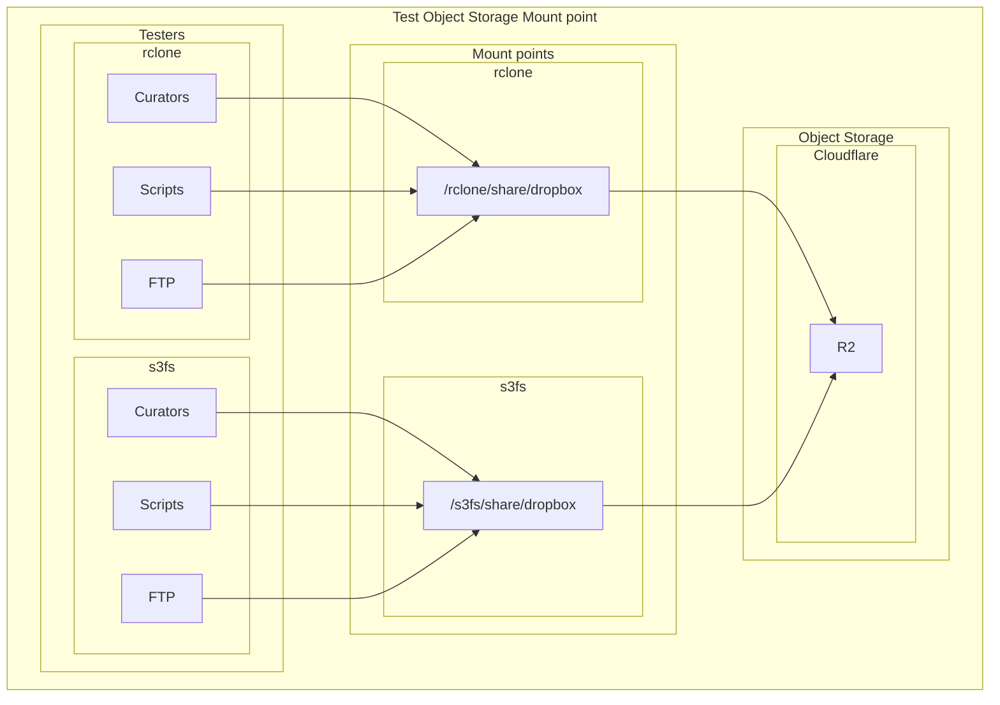

# Object Storage Mounting Guide

This document provides background information of rclone mount and s3fs mount, and a detailed guide to mount object storage on remote servers.

### Background

1. s3fs vs. rclone mount: Key Differences & Recommendations


| Feature	          | s3fs                                                                                                    | rclone mount                                                                                                     | 	Recommendation                        |
|:------------------|:--------------------------------------------------------------------------------------------------------|:-----------------------------------------------------------------------------------------------------------------|:---------------------------------------|
| Architecture      | 	FUSE-based, translates POSIX calls to S3 API. Strict POSIX emulation (e.g., file locking, permissions) | Uses virtual filesystem (VFS) layer. Prioritizes performance over strict POSIX compliance                        | 	rclone for performance                | 
| Performance       | 	Moderate (high metadata overhead), struggles with small-file operations                                | 	Generally higher throughput, especially for large files                                                         | 	rclone (10x+ speed in sequential ops) |
| Caching           | 	Supports local caching, but can be less efficient for large datasets                                   | 	Highly configurable VFS cache (--vfs-cache-mode) for reads and writes                                           | 	rclone for better caching             |
| POSIX Compliance  | 	High (supports permissions, ownership)                                                                 | 	Limited (e.g., no chmod/chown)                                                                                  | 	s3fs if strict POSIX required         | 
| Use Cases         | 	Legacy apps needing filesystem semantics                                                               | 	Bulk data xfer, read-heavy workloads                                                                            | 	rclone for R2-centric pipelines       | 
| Resource Usage    | 	Can be resource-intensive with many small files                                                        | 	Can use more memory, especially with a large VFS cache                                                          | 	rclone for resource efficiency        |
| Scalability       | 	Risk of hangs with heavy metadata ops                                                                  | More resilient for large-file I/O                                                                                | rclone for scalability                 | 
| Compatibility     | 	Works with most S3-compatible services                                                                 | 	Supports over 70 cloud providers, including R2                                                                  | 	rclone for broader compatibility      |
| Installation      | 	Easy to install, but may require additional dependencies                                               | 	Requires rclone installation, but straightforward setup                                                         | 	rclone for ease of use                |
| Community Support | 	Active community, but less frequent updates                                                            | 	Large community, frequent updates, and extensive documentation                                                  | 	rclone for active support             |

Bottom Line: For general-purpose mounting of an R2 bucket, rclone mount is often the better choice due to its superior performance, advanced caching capabilities, and active development.
s3fs is prone to "busy" mount issues due to its FUSE implementation, and multipart uploads can be problematic.
s3fs cache eats up a lot of disk space, and it is not as efficient for large datasets or high-throughput workloads.
```
[ec2-user@ip-10-99-0-232 ~]$ sudo du -sh /tmp/cache/rclone/
0       /tmp/cache/rclone/
[ec2-user@ip-10-99-0-232 ~]$ sudo du -sh /tmp/cache/s3fs/
4.1G    /tmp/cache/s3fs/
```

### Mount Object Storage, eg. R2 Bucket

#### Prerequisites

- Ensure you have access to a Cloudflare R2 bucket and the necessary credentials (Access Key ID and Secret Access Key) and the endpoint URL.
- Ensure you have `s3fs` or `rclone` installed on your system.
- if not root mounting, will get error: `fusermount: option allow_other only allowed if 'user_allow_other' is set in /etc/fuse.conf`, can be fixed by:
```
[ec2-user@ip-10-99-0-232 ~]$ sudo vi /etc/fuse.conf
# Uncomment the following line
#user_allow_other
```
- For `s3fs`, you need to create a password file with your R2 credentials.
```
[ec2-user@ip-10-99-0-232 ~]$ echo $r2-access-key-id:$r2-secret-access-key > ~/.passwd_file
[ec2-user@ip-10-99-0-232 ~]$ chmod 600 ~/.passwd_file
```
- For `rclone`, you need to configure a remote pointing to your R2 bucket.
 

#### s3fs Mount

```
[ec2-user@ip-10-99-0-232 ~]$ s3fs test-gigadb-dropbox /s3fs \
-o passwd_file=~/.passwd_file \
-o url=https://$account-id.r2.cloudflarestorage.com \
-o allow_other \
-o umask=000 \
-o nomultipart \
-o sigv4 \
-o logfile=/var/log/gigadb/s3fs-r2.log
```

-o passwd_file: Specifies the file containing your R2 credentials.
-o url: Crucially, sets the endpoint to your Cloudflare R2 account.
-o use_cache: Enables local caching of files in the specified directory, whenever s3fs needs to read or write a file on s3 it first downloads the entire file locally to the folder specified by use_cache and operates on it.
-o max_stat_cache_size: Increases the size of the metadata stat cache to speed up lookups.
-o endpoint=auto: Required for R2
-o max_concurrent_requests=100: Increase concurrency
-o multipart_size=128: Better for large files, but not supported by R2
-o parallel_count: will get error: `curl.cpp:RequestPerform(2716): ### CURLE_SEND_ERROR`

#### rclone Mount

```
[ec2-user@ip-10-99-0-232 ~]$ rclone mount r2:$your-bucket /rclone \
--daemon \
--cache-dir /tmp/cache/rclone \
--vfs-cache-mode full \
--vfs-cache-max-size 10G \
--vfs-read-chunk-size 32M \
--vfs-read-chunk-size-limit 2G \
--allow-other \
--log-file /var/log/gigadb/rclone-r2.log \
--log-level INFO
```

--allow-other: Allows other users on the system to access the mount.
--daemon: Runs the mount process in the background.
--buffer-size 32M: Sets the size of the buffer used for reading files.
--vfs-cache-mode full: enable read/write caching.
--vfs-cache-mode writes: Safe write buffering for uploads.
--vfs-cache-max-size: Sets a limit on the local cache size (adjust based on available disk space).
--vfs-read-chunk-size / --buffer-size: These flags can be tuned to increase read throughput by fetching larger chunks at a time, improve sequential read.
--vfs-read-ahead 1G: Prefetch large files
--log-file: Logs output to a file for easier debugging.

#### Mount points checking

```
[ec2-user@ip-10-99-0-232 ~]$ df -h | grep s3fs
s3fs                     64P     0   64P   0% /s3fs
[ec2-user@ip-10-99-0-232 ~]$ mount | grep s3fs
s3fs on /s3fs type fuse.s3fs (rw,nosuid,nodev,relatime,user_id=1000,group_id=1000,allow_other)
[ec2-user@ip-10-99-0-232 ~]$ ls -al /s3fs/share/dropbox/user5/
total 15
drwxr-xr-x. 1 ec2-user ec2-user 4096 Jun  6 04:09 .
drwxr-xr-x. 1 ec2-user ec2-user 4096 Jun  6 06:47 ..
-rw-r--r--. 1 ec2-user ec2-user   25 Jun  6 06:32 102498.filesizes
-rw-r--r--. 1 ec2-user ec2-user   54 Jun  6 06:32 102498.md5
-rw-r--r--. 1 root     root     5128 Jun  6 06:29 readme_102498.txt
[ec2-user@ip-10-99-0-232 ~]$ 
[ec2-user@ip-10-99-0-232 ~]$ df -h | grep rclone
r2:test-gigadb-dropbox  1.0P     0  1.0P   0% /rclone
[ec2-user@ip-10-99-0-232 ~]$ mount | grep rclone
r2:test-gigadb-dropbox on /rclone type fuse.rclone (rw,nosuid,nodev,relatime,user_id=1000,group_id=1000,allow_other)
[ec2-user@ip-10-99-0-232 ~]$ ls -al /rclone/share/dropbox/user5/
total 7
drwxr-xr-x. 1 ec2-user ec2-user    0 Jun 11 04:21 .
drwxr-xr-x. 1 ec2-user ec2-user    0 Jun 11 04:21 ..
-rw-r--r--. 1 ec2-user ec2-user   25 Jun  6 06:32 102498.filesizes
-rw-r--r--. 1 ec2-user ec2-user   54 Jun  6 06:32 102498.md5
-rw-r--r--. 1 ec2-user ec2-user 5128 Jun  6 06:29 readme_102498.txt
[ec2-user@ip-10-99-0-232 ~]$ 

```


### Performance and Benchmarks

#### efs mount performance

| under test                | command                                                                                           | time (s) | throughput (MB/s) | %CPU |
|:--------------------------|:--------------------------------------------------------------------------------------------------|:---------|:------------------|:-----|
| 1G File Write             | dd if=/dev/zero of=/share/dropbox/user666/efs-test-write.dat bs=1G count=1 oflag=direct           | 2.68551  | 400               | ~30  |
| 10G File Write            | dd if=/dev/zero of=/share/dropbox/user666/efs-test-write.dat bs=1G count=10 oflag=direct          | 22.7551  | 472               | ~30  |
| 1G File Read              | dd if=/share/dropbox/user666/efs-test-write.dat of=/dev/null bs=1G count=1                        | 8.17188  | 131               | ~10  |
| 10G File Read             | dd if=/share/dropbox/user666/efs-test-write.dat of=/dev/null bs=1G count=10                       | 79.3294  | 135               | ~10  |
| Move in 5000 small files  | time cp -v /tmp/smallfiles/* /share/dropbox/user666/smallfiles/                                   | 1m8.337  |                   | ~10  |
| Move out 5000 small files | time cp -v /share/dropbox/user666/smallfiles/* /tmp/smallfiles/                                   | 11.414   |                   | ~10  |
| md5sum Checksum           | time md5sum /share/dropbox/user666/efs-test-write.dat > /share/dropbox/user666/efs-test-write.md5 | 2m30.059 |                   |      |

```
[ec2-user@ip-10-99-0-232 ~]$ cat /share/dropbox/user666/efs-test-write.md5
2dd26c4d4799ebd29fa31e48d49e8e53  /share/dropbox/user666/efs-test-write.dat
```

##### rclone mount performance

| under test                | command                                                                                                         | time (s) | throughput (MB/s) | %CPU |
|:--------------------------|:----------------------------------------------------------------------------------------------------------------|:---------|:------------------|:-----|
| 4G File Write             | dd if=/dev/zero of=/rclone/share/dropbox/user999/rclone-test-write.dat bs=1G count=1 oflag=direct               | 7.04971  | 145               | ~8   |
| 10G File Write            | dd if=/dev/zero of=/rclone/share/dropbox/user999/rclone-test-write.dat bs=1G count=10 oflag=direct              | 79.6255  | 135               | ~8   |
| 4G File Read              | dd if=/rclone/share/dropbox/user999/rclone-test-write.dat of=/dev/null bs=1G count=1                            | 7.33058  | 146               | ~10  |
| 10G File Read             | dd if=/rclone/share/dropbox/user999/rclone-test-write.dat of=/dev/null bs=1G count=10                           | 198.155  | 54.2              | ~10  |
| Move in 1000 small files  | time cp -v /tmp/smallfiles/* /rclone/share/dropbox/user999/smallfiles/                                          | 13.044   |                   | ~20  |
| Move out 1000 small files | time cp -v /rclone/share/dropbox/user999/smallfiles/* /tmp/smallfiles/                                          | 10.913   |                   | ~10  |
| md5sum Checksum           | time md5sum /rclone/share/dropbox/user999/efs-test-write.dat > /rclone/share/dropbox/user999/efs-test-write.md5 | 1m29.463 |                   |      |

```
[ec2-user@ip-10-99-0-232 ~]$ cp /share/dropbox/user666/efs-test-write.dat /rclone/share/dropbox/user999/
[ec2-user@ip-10-99-0-232 ~]$ cat /rclone/share/dropbox/user999/efs-test-write.md5
2dd26c4d4799ebd29fa31e48d49e8e53  /rclone/share/dropbox/user999/efs-test-write.dat
```

##### s3fs mount performance
| under test                | Command                                                                           | time (s) | throughput (MB/s) | %CPU |
|:--------------------------|:----------------------------------------------------------------------------------|:---------|:------------------|:-----|
| 4G File Write             | dd if=/dev/zero of=/s3fs/share/dropbox/user555/s3fs-test-write.dat bs=1G count=4  | 351.712  | 12.2              | 5-63 |
| 10G File Write            | dd if=/s3fs/share/dropbox/user555/s3fs-test-write.dat of=/dev/null bs=1G count=10 | 33.5228  | 128               | 5-63 | 
| 4G File Read              | dd if=/s3fs/share/dropbox/user555/s3fs-test-write.dat of=/dev/null bs=1G count=4  | 45.7526  | 93.9              | 10   |
| 10G File Read             | dd if=/s3fs/share/dropbox/user555/s3fs-test-write.dat of=/dev/null bs=1G count=10 | 153.519  | 69.9              | 10   |
| Move in 1000 small files  |                                                                                   |          |                   |      |
| Move out 1000 small files |                                                                                   |          |                   |      |
| Random Read/Write IOPS    |


```mermaid
[ec2-user@ip-10-99-0-232 ~]$ mkdir /tmp/smallfiles && for i in {1..5000}; do dd if=/dev/urandom of=/tmp/smallfiles/file$i.dat bs=1k count=4; done
[ec2-user@ip-10-99-0-232 ~]$ du -sh /tmp/smallfiles/
20M     /tmp/smallfiles/
```

### Testing and Validation



### References
- [s3fs-fuse](https://github.com/s3fs-fuse/s3fs-fuse)
- [rclone mount](https://rclone.org/commands/rclone_mount)
- Example s3fs [mount command](https://community.hetzner.com/tutorials/object-storage-based-filesystem)
- Example rclone [mount command](https://forum.rclone.org/t/recommend-mount-settings-for-cloudflare-r2/38001)
- Cloudflare R2 [documentation](https://developers.cloudflare.com/r2/)
- Cloudflare R2 configuration with [rclone](https://developers.cloudflare.com/r2/examples/rclone/)