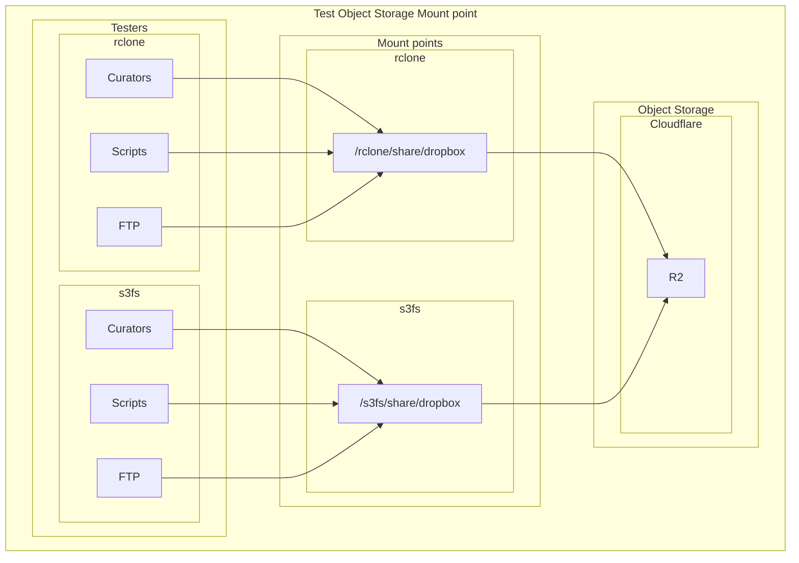

# Object Storage Mounting Guide

This document provides background information of rclone mount and s3fs mount, and a detailed guide to mount object storage on remote servers.

### Background

1. s3fs vs. rclone mount: Key Differences & Recommendations


| Feature	          | s3fs                                                                                                    | rclone mount                                                                                                     | 	Recommendation                        |
|:------------------|:--------------------------------------------------------------------------------------------------------|:-----------------------------------------------------------------------------------------------------------------|:---------------------------------------|
| Architecture      | 	FUSE-based, translates POSIX calls to S3 API. Strict POSIX emulation (e.g., file locking, permissions) | Uses virtual filesystem (VFS) layer. Prioritizes performance over strict POSIX compliance                        | 	rclone for performance                | 
| Performance       | 	Moderate (high metadata overhead), struggles with small-file operations                                | 	Generally higher throughput, especially for large files                                                         | 	rclone (10x+ speed in sequential ops) |
| Caching           | 	Supports local caching, but can be less efficient for large datasets                                   | 	Highly configurable VFS cache (--vfs-cache-mode) for reads and writes                                           | 	rclone for better caching             |
| POSIX Compliance  | 	High (supports permissions, ownership)                                                                 | 	Limited (e.g., no chmod/chown)                                                                                  | 	s3fs if strict POSIX required         | 
| Use Cases         | 	Legacy apps needing filesystem semantics                                                               | 	Bulk data xfer, read-heavy workloads                                                                            | 	rclone for R2-centric pipelines       | 
| Resource Usage    | 	Can be resource-intensive with many small files                                                        | 	Can use more memory, especially with a large VFS cache                                                          | 	rclone for resource efficiency        |
| Scalability       | 	Risk of hangs with heavy metadata ops                                                                  | More resilient for large-file I/O                                                                                | rclone for scalability                 | 
| Compatibility     | 	Works with most S3-compatible services                                                                 | 	Supports over 70 cloud providers, including R2                                                                  | 	rclone for broader compatibility      |
| Installation      | 	Easy to install, but may require additional dependencies                                               | 	Requires rclone installation, but straightforward setup                                                         | 	rclone for ease of use                |
| Community Support | 	Active community, but less frequent updates                                                            | 	Large community, frequent updates, and extensive documentation                                                  | 	rclone for active support             |

Bottom Line: For general-purpose mounting of an R2 bucket, rclone mount is often the better choice due to its superior performance, advanced caching capabilities, and active development.
s3fs is prone to "busy" mount issues due to its FUSE implementation, and multipart uploads can be problematic.
s3fs cache eats up a lot of disk space, and it is not as efficient for large datasets or high-throughput workloads.


### Mount Object Storage, eg. R2 Bucket

#### Prerequisites

- Ensure you have access to a Cloudflare R2 bucket and the necessary credentials (Access Key ID and Secret Access Key) and the endpoint URL.
- Ensure you have `s3fs` or `rclone` installed on your system.
- if not root mounting, will get error: `fusermount: option allow_other only allowed if 'user_allow_other' is set in /etc/fuse.conf`, can be fixed by:
```
[ec2-user@ip-10-99-0-232 ~]$ sudo vi /etc/fuse.conf
# Uncomment the following line
#user_allow_other
```
- For `s3fs`, you need to create a password file with your R2 credentials.
```
[ec2-user@ip-10-99-0-232 ~]$ echo $r2-access-key-id:$r2-secret-access-key > ~/.passwd_file
[ec2-user@ip-10-99-0-232 ~]$ chmod 600 ~/.passwd_file
```
- For `rclone`, you need to configure a remote pointing to your R2 bucket.
 

#### s3fs Mount

```
[ec2-user@ip-10-99-0-232 ~]$ s3fs test-gigadb-dropbox /s3fs \
-o passwd_file=~/.passwd_file \
-o url=https://$account-id.r2.cloudflarestorage.com \
-o allow_other \
-o umask=000 \
-o nomultipart \
-o sigv4 \
-o logfile=/var/log/gigadb/s3fs-r2.log
```

-o passwd_file: Specifies the file containing your R2 credentials.
-o url: Crucially, sets the endpoint to your Cloudflare R2 account.
-o use_cache: Enables local caching of files in the specified directory, whenever s3fs needs to read or write a file on s3 it first downloads the entire file locally to the folder specified by use_cache and operates on it.
-o max_stat_cache_size: Increases the size of the metadata stat cache to speed up lookups.
-o endpoint=auto: Required for R2
-o max_concurrent_requests=100: Increase concurrency
-o multipart_size=128: Better for large files, but not supported by R2
-o parallel_count: will get error: `curl.cpp:RequestPerform(2716): ### CURLE_SEND_ERROR`

#### rclone Mount

```
[ec2-user@ip-10-99-0-232 ~]$ rclone mount r2:$your-bucket /rclone \
--daemon \
--cache-dir /tmp/cache/rclone \
--vfs-cache-mode full \
--vfs-cache-max-size 10G \
--vfs-read-chunk-size 32M \
--vfs-read-chunk-size-limit 2G \
--allow-other \
--log-file /var/log/gigadb/rclone-r2.log \
--log-level INFO
```

--allow-other: Allows other users on the system to access the mount.
--daemon: Runs the mount process in the background.
--buffer-size 32M: Sets the size of the buffer used for reading files.
--vfs-cache-mode full: enable read/write caching.
--vfs-cache-mode writes: Safe write buffering for uploads.
--vfs-cache-max-size: Sets a limit on the local cache size (adjust based on available disk space).
--vfs-read-chunk-size / --buffer-size: These flags can be tuned to increase read throughput by fetching larger chunks at a time, improve sequential read.
--vfs-read-ahead 1G: Prefetch large files
--log-file: Logs output to a file for easier debugging.

#### Mount points checking

```
[ec2-user@ip-10-99-0-232 ~]$ df -h | grep s3fs
s3fs                     64P     0   64P   0% /s3fs
[ec2-user@ip-10-99-0-232 ~]$ mount | grep s3fs
s3fs on /s3fs type fuse.s3fs (rw,nosuid,nodev,relatime,user_id=1000,group_id=1000,allow_other)
[ec2-user@ip-10-99-0-232 ~]$ ls -al /s3fs/share/dropbox/user5/
total 15
drwxr-xr-x. 1 ec2-user ec2-user 4096 Jun  6 04:09 .
drwxr-xr-x. 1 ec2-user ec2-user 4096 Jun  6 06:47 ..
-rw-r--r--. 1 ec2-user ec2-user   25 Jun  6 06:32 102498.filesizes
-rw-r--r--. 1 ec2-user ec2-user   54 Jun  6 06:32 102498.md5
-rw-r--r--. 1 root     root     5128 Jun  6 06:29 readme_102498.txt
[ec2-user@ip-10-99-0-232 ~]$ 
[ec2-user@ip-10-99-0-232 ~]$ df -h | grep rclone
r2:test-gigadb-dropbox  1.0P     0  1.0P   0% /rclone
[ec2-user@ip-10-99-0-232 ~]$ mount | grep rclone
r2:test-gigadb-dropbox on /rclone type fuse.rclone (rw,nosuid,nodev,relatime,user_id=1000,group_id=1000,allow_other)
[ec2-user@ip-10-99-0-232 ~]$ ls -al /rclone/share/dropbox/user5/
total 7
drwxr-xr-x. 1 ec2-user ec2-user    0 Jun 11 04:21 .
drwxr-xr-x. 1 ec2-user ec2-user    0 Jun 11 04:21 ..
-rw-r--r--. 1 ec2-user ec2-user   25 Jun  6 06:32 102498.filesizes
-rw-r--r--. 1 ec2-user ec2-user   54 Jun  6 06:32 102498.md5
-rw-r--r--. 1 ec2-user ec2-user 5128 Jun  6 06:29 readme_102498.txt
[ec2-user@ip-10-99-0-232 ~]$ 

```


### Performance and Benchmarks

##### testing environment
```
[ec2-user@ip-10-99-0-232 ~]$ uname -a
Linux ip-10-99-0-232.eu-north-1.compute.internal 5.14.0-587.el9.x86_64 #1 SMP PREEMPT_DYNAMIC Fri May 23 17:57:08 UTC 2025 x86_64 x86_64 x86_64 GNU/Linux
[ec2-user@ip-10-99-0-232 ~]$ free -h
               total        used        free      shared  buff/cache   available
Mem:           1.6Gi       741Mi        88Mi        11Mi       1.0Gi       927Mi
Swap:             0B          0B          0B
[ec2-user@ip-10-99-0-232 ~]$
[ec2-user@ip-10-99-0-232 ~]$ df -h
[ec2-user@ip-10-99-0-232 ~]$ df -h
Filesystem              Size  Used Avail Use% Mounted on
devtmpfs                4.0M     0  4.0M   0% /dev
tmpfs                   835M     0  835M   0% /dev/shm
tmpfs                   334M   12M  323M   4% /run
/dev/nvme0n1p2           30G   5G  25G 16% /
tmpfs                   167M     0  167M   0% /run/user/1000
127.0.0.1:/             8.0E   23G  8.0E   1% /share/dropbox
127.0.0.1:/             8.0E   23G  8.0E   1% /share/config
r2:test-gigadb-dropbox  1.0P     0  1.0P   0% /rclone
s3fs                     64P     0   64P   0% /s3fs

```

##### Create files for testing
```
[ec2-user@ip-10-99-0-232 ~]$ mkdir -p test-mount
[ec2-user@ip-10-99-0-232 ~]$ dd if=/dev/zero of=./test-mount/1g-file.dat bs=1G count=1
1+0 records in
1+0 records out
1073741824 bytes (1.1 GB, 1.0 GiB) copied, 7.44773 s, 144 MB/s
[ec2-user@ip-10-99-0-232 ~]$ dd if=/dev/zero of=./test-mount/10g-file.dat bs=1G count=10
10+0 records in
10+0 records out
10737418240 bytes (11 GB, 10 GiB) copied, 79.6953 s, 135 MB/s
ec2-user@ip-10-99-0-232 ~]$ ls -al test-mount/
total 11534348
drwxr-xr-x.  2 ec2-user ec2-user          64 Jun 13 07:09 .
drwx------. 18 ec2-user ec2-user        4096 Jun 13 06:59 ..
-rw-r--r--.  1 ec2-user ec2-user 10737418240 Jun 13 07:10 10g-file.dat
-rw-r--r--.  1 ec2-user ec2-user  1073741824 Jun 13 07:00 1g-file.dat
[ec2-user@ip-10-99-0-232 ~]$ time md5sum test-mount/1g-file.dat > test-mount/1g-file.md5

real    0m6.966s
user    0m1.772s
sys     0m0.426s
[ec2-user@ip-10-99-0-232 ~]$ cat test-mount/1g-file.md5 
cd573cfaace07e7949bc0c46028904ff  test-mount/1g-file.dat
[ec2-user@ip-10-99-0-232 ~]$ time md5sum test-mount/10g-file.dat > test-mount/10g-file.md5

real    1m18.926s
user    0m17.605s
sys     0m3.878s
[ec2-user@ip-10-99-0-232 ~]$ cat test-mount/10g-file.md5 
2dd26c4d4799ebd29fa31e48d49e8e53  test-mount/10g-file.dat
[ec2-user@ip-10-99-0-232 ~]$ mkdir /tmp/smallfiles && for i in {1..5000}; do dd if=/dev/urandom of=/tmp/smallfiles/file$i.dat bs=1k count=4; done
[ec2-user@ip-10-99-0-232 ~]$ du -sh /tmp/smallfiles/
20M     /tmp/smallfiles/
```

##### efs mount performance

| under test                 | command                                                                                           | time (s) | throughput (MB/s) | %CPU |
|:---------------------------|:--------------------------------------------------------------------------------------------------|:---------|:------------------|:-----|
| 1G File Write              | dd if=/dev/zero of=/share/dropbox/user666/efs-test-write.dat bs=1G count=1 oflag=direct           | 2.68551  | 400               | ~30  |
| 10G File Write             | dd if=/dev/zero of=/share/dropbox/user666/efs-test-write.dat bs=1G count=10 oflag=direct          | 22.7551  | 472               | ~30  |
| 1G File Read               | dd if=/share/dropbox/user666/efs-test-write.dat of=/dev/null bs=1G count=1                        | 8.17188  | 131               | ~10  |
| 10G File Read              | dd if=/share/dropbox/user666/efs-test-write.dat of=/dev/null bs=1G count=10                       | 79.3294  | 135               | ~10  |
| Move in 5000 small files   | time cp -v /tmp/smallfiles/* /share/dropbox/user666/smallfiles/                                   | 1m8.337  | N/A               | ~10  |
| Move out 5000 small files  | time cp -v /share/dropbox/user666/smallfiles/* /tmp/smallfiles/                                   | 11.414   | N/A               | ~10  |
| Move in 1 1G file          | time cp test-mount/1g-file.dat /share/dropbox/user666/                                            | 7.342    | N/A               | ~10  |
| md5sum Checksum 1G file    | time md5sum /share/dropbox/user666/1g-file.dat > /share/dropbox/user666/1g-file.md5               | 3.268    | N/A               | ~12  |
| Move out 1 1G file         | time cp /share/dropbox/user666/1g-file.dat /dev/zero                                              | 8.673    | N/A               | ~10  |
| Move in 1 10G file         | time cp test-mount/10g-file.dat /share/dropbox/user666/                                           | 1m19.174 | N/A               | ~13  |
| md5sum Checksum 10G file   | time md5sum /share/dropbox/user666/10g-file.dat > /share/dropbox/user666/10g-file.md5             | 2m25.654 | N/A               | ~15  |
| Move out 1 10G file        | time cp /share/dropbox/user666/10g-file.dat /dev/zero                                             | 1m25.254 | N/A               | ~10  |


```
[ec2-user@ip-10-99-0-232 ~]$ cat /share/dropbox/user666/1g-file.md5 
cd573cfaace07e7949bc0c46028904ff  /share/dropbox/user666/1g-file.dat
[ec2-user@ip-10-99-0-232 ~]$ cat /share/dropbox/user666/10g-file.md5 
2dd26c4d4799ebd29fa31e48d49e8e53  /share/dropbox/user666/10g-file.dat
[ec2-user@ip-10-99-0-232 ~]$
```

##### rclone mount AWS s3 performance

| under test                | command                                                                                                                 | time (s)  | throughput (MB/s) | %CPU |
|:--------------------------|:------------------------------------------------------------------------------------------------------------------------|:----------|:------------------|:-----|
| 1G File Write             | dd if=/dev/zero of=/aws/share/dropbox/user111/rclone-test-write-1g.dat bs=1G count=1 oflag=direct                       | 7.33122   | 146               | ~2   |
| 10G File Write            | dd if=/dev/zero of=/aws/share/dropbox/user111/rclone-test-write-10g.dat bs=1G count=10 oflag=direct                     | 83.0727   | 129               | ~2   |
| 1G File Read              | dd if=/aws/share/dropbox/user111/rclone-test-write-1g.dat of=/dev/null bs=1G count=1                                    | 86.6436   | 12.4              | ~1   |
| 10G File Read             | dd if=/aws/share/dropbox/user111/rclone-test-write-10g.dat of=/dev/null bs=1G count=10                                  | 164.786   | 65.2              | ~7   |
| Move in 5000 small files  | time cp -v /tmp/smallfiles/* /aws/share/dropbox/user111/smallfiles/                                                     | 11.805    | N/A               | ~7   |
| Move out 5000 small files | time cp -v /aws/share/dropbox/user111/smallfiles/* /tmp/smallfiles/                                                     | 38m59.513 | N/A               | ~1   |
| Move in 1 1G file         | time cp -v rclone-test-write-1g.dat /aws/share/dropbox/user111/                                                         | 14.977    | N/A               | ~7   |
| md5sum Checksum 1G file   | time md5sum /aws/share/dropbox/user111/rclone-test-write-1g.dat > /aws/share/dropbox/user111/rclone-test-write-1g.md5   | 7.427     | N/A               | ~7   |
| Move out 1 1G file        | time cp -v /aws/share/dropbox/user111/rclone-test-write-1g.dat /dev/zero                                                | 8.246     | N/A               | ~10  |
| Move in 1 10G file        | time cp -v rclone-test-write-10g.dat /aws/share/dropbox/user111/                                                        | 2m39.314  | N/A               | ~7   |
| md5sum Checksum 10G file  | time md5sum /aws/share/dropbox/user111/rclone-test-write-10g.dat > /aws/share/dropbox/user111/rclone-test-write-10g.md5 | 12m10.314 | N/A               | ~4   |
| Move out 1 10G file       | time cp -v /aws/share/dropbox/user111/rclone-test-write-10g.dat /dev/zero                                               | 11m47.102 | N/A               | ~3   |

```
[ec2-user@ip-10-99-0-193 ~]$ cat /aws/share/dropbox/user111/rclone-test-write-1g.md5 
cd573cfaace07e7949bc0c46028904ff  /aws/share/dropbox/user111/rclone-test-write-1g.dat
[ec2-user@ip-10-99-0-193 ~]$ cat /aws/share/dropbox/user111/rclone-test-write-10g.md5 
2dd26c4d4799ebd29fa31e48d49e8e53  /aws/share/dropbox/user111/rclone-test-write-10g.dat
[ec2-user@ip-10-99-0-193 ~]$ 
```

##### rclone mount Wasabi s3 performance

| under test                | command                                                                                                         | time (s) | throughput (MB/s) | %CPU |
|:--------------------------|:----------------------------------------------------------------------------------------------------------------|:---------|:------------------|:-----|
| 1G File Write             | dd if=/dev/zero of=/rclone/share/dropbox/user999/rclone-test-write.dat bs=1G count=1 oflag=direct               | 7.04971  | 145               | ~8   |
| 10G File Write            | dd if=/dev/zero of=/rclone/share/dropbox/user999/rclone-test-write.dat bs=1G count=10 oflag=direct              | 79.6255  | 135               | ~8   |
| 1G File Read              | dd if=/rclone/share/dropbox/user999/rclone-test-write.dat of=/dev/null bs=1G count=1                            | 7.33058  | 146               | ~10  |
| 10G File Read             | dd if=/rclone/share/dropbox/user999/rclone-test-write.dat of=/dev/null bs=1G count=10                           | 198.155  | 54.2              | ~10  |
| Move in 5000 small files  | time cp -v /tmp/smallfiles/* /rclone/share/dropbox/user999/smallfiles/                                          | 13.044   | N/A               | ~20  |
| Move out 5000 small files | time cp -v /rclone/share/dropbox/user999/smallfiles/* /tmp/smallfiles/                                          | 10.913   | N/A               | ~10  |
| Move in 1 1G file         | time cp test-mount/1g-file.dat /rclone/share/dropbox/user999/                                                   | 15.169   | N/A               | ~10  |
| md5sum Checksum 1G file   | time md5sum /rclone/share/dropbox/user999/1g-file.dat > /rclone/share/dropbox/user999/1g-file.md5               | 7.013    | N/A               | ~12  |
| Move out 1 1G file        | time cp /rclone/share/dropbox/user999/1g-file.dat /dev/zero                                                     | 7.538    | N/A               | ~10  |
| Move in 1 10G file        | time cp test-mount/10g-file.dat /rclone/share/dropbox/user999/                                                  | 2m44.754 | N/A               | ~10  |
| md5sum Checksum 10G file  | time md5sum /rclone/share/dropbox/user999/efs-test-write.dat > /rclone/share/dropbox/user999/10g-file.md5       | 8m51.821 | N/A               | ~15  |
| Move out 1 10G file       | time cp /rclone/share/dropbox/user999/10g-file.dat /dev/zero                                                    | 2m38.453 | N/A               | ~15  |

```
[ec2-user@ip-10-99-0-232 ~]$ cat /rclone/share/dropbox/user999/1g-file.md5 
cd573cfaace07e7949bc0c46028904ff  /rclone/share/dropbox/user999/1g-file.dat
[ec2-user@ip-10-99-0-232 ~]$ cat /rclone/share/dropbox/user999/10g-file.md5 
2dd26c4d4799ebd29fa31e48d49e8e53  /rclone/share/dropbox/user999/efs-test-write.dat
```

##### rclone mount storage box performance
| under test                | command                                                                                                                    | time (s) | throughput (MB/s) | %CPU  |
|:--------------------------|:---------------------------------------------------------------------------------------------------------------------------|:---------|:------------------|:------|
| 1G File Write             | dd if=/dev/zero of=/block/share/dropbox/user444/rclone-test-write-1g.dat bs=1G count=1 oflag=direct                        | 7.59095  | 141               | ~8    |
| 10G File Write            | dd if=/dev/zero of=/block/share/dropbox/user444/rclone-test-write-10g.dat bs=1G count=10 oflag=direct                      | 79.1779  | 136               | ~8    |
| 1G File Read              | dd if=/block/share/dropbox/user444/rclone-test-write-1g.dat of=/dev/null bs=1G count=1                                     | 15.5097  | 69.2              | ~10   |
| 10G File Read             | dd if=/block/share/dropbox/user444/rclone-test-write-10g.dat of=/dev/null bs=1G count=10                                   | 93.4351  | 115               | ~10   |
| Move in 5000 small files  | time cp -v /tmp/smallfiles/* /block/share/dropbox/user444/smallfiles/                                                      | 11.599   | N/A               | ~8    |
| Move out 5000 small files | time cp -v /block/share/dropbox/user444/smallfiles/* /tmp/smallfiles/                                                      | 7.758    | N/A               | ~8    |
| Move in 1 1G file         | time cp rclone-test-write-1g.dat /block/share/dropbox/user444/                                                             | 15.901   | N/A               | ~6    |
| md5sum Checksum 1G file   | time md5sum /block/share/dropbox/user444/rclone-test-write-1g.dat > /block/share/dropbox/user444/1g-file.md5               | 10.221   | N/A               | ~17   |
| Move out 1 1G file        | time cp /block/share/dropbox/user444/rclone-test-write-1g.dat /dev/zero                                                    | 14.187   | N/A               | ~9    |
| Move in 1 10G file        | time cp rclone-test-write-10g.dat /block/share/dropbox/user444/                                                            | 2m57.629 | N/A               | ~7    |
| md5sum Checksum 10G file  | time md5sum /block/share/dropbox/user444/rclone-test-write-10g.dat > /block/share/dropbox/user444/10g-file.md5             | 2m19.732 | N/A               | ~19.9 |
| Move out 1 10G file       | time cp /block/share/dropbox/user444/rclone-test-write-10g.dat /dev/zero                                                   | 3m2.676  | N/A               | ~10   |

```
[ec2-user@ip-10-99-0-193 ~]$ time md5sum rclone-test-write-1g.dat > rclone-test-write-1g.md5

real    0m8.950s
user    0m1.741s
sys     0m0.420s
[ec2-user@ip-10-99-0-193 ~]$ time md5sum rclone-test-write-10g.dat > rclone-test-write-10g.md5

real    1m21.880s
user    0m17.358s
sys     0m3.934s
[ec2-user@ip-10-99-0-193 ~]$ cat rclone-test-write-1g.md5 
cd573cfaace07e7949bc0c46028904ff  rclone-test-write-1g.dat
[ec2-user@ip-10-99-0-193 ~]$ cat rclone-test-write-10g.md5 
2dd26c4d4799ebd29fa31e48d49e8e53  rclone-test-write-10g.dat
[ec2-user@ip-10-99-0-193 ~]$ cat /block/share/dropbox/user444/1g-file.md5 
cd573cfaace07e7949bc0c46028904ff  /block/share/dropbox/user444/rclone-test-write-1g.dat
[ec2-user@ip-10-99-0-193 ~]$ cat /block/share/dropbox/user444/10g-file.md5 
2dd26c4d4799ebd29fa31e48d49e8e53  /block/share/dropbox/user444/rclone-test-write-10g.dat
```

```
% cat ~/.ssh/$public_key | ssh -p23 $user@$user.your-storagebox.de install-ssh-key
% ssh -i ~/.ssh/$private_key -p23 $user@$user.your-storagebox.de
Last login: Tue Jul  8 01:58:37 2025 from 223.197.187.121
+------------------------------------------------------------------+
| Welcome to your Storage Box.                                     |
|                                                                  |
| Please note that this is only a restricted shell environment and |
| therefore some shell features like pipes and redirects are not   |
| supported.                                                       |
+------------------------------------------------------------------+
u472088 /home > ls
mount
u472088 /home > ls -al mount
total 2
drwxrwxr-x 3 u472088 u472088 3 Jul  7 06:26 .
drwxr-xr-x 4 u472088 u472088 5 Jul  7 06:26 ..
drwxrwxr-x 3 u472088 u472088 3 Jul  7 03:55 share
u472088 /home > ls -al mount/share
total 2
drwxrwxr-x 3 u472088 u472088 3 Jul  7 03:55 .
drwxrwxr-x 3 u472088 u472088 3 Jul  7 06:26 ..
drwxrwxr-x 3 u472088 u472088 3 Jul  8 02:31 dropbox
u472088 /home > ls -al mount/share/dropbox/user444
total 540
drwxrwxr-x 3 u472088 u472088           7 Jul  8 03:14 .
drwxrwxr-x 3 u472088 u472088           3 Jul  8 02:31 ..
-rw-rw-r-- 1 u472088 u472088          89 Jul  8 03:14 10g-file.md5
-rw-rw-r-- 1 u472088 u472088          88 Jul  8 03:10 1g-file.md5
-rw-rw-r-- 1 u472088 u472088 10737418240 Jul  8 03:23 rclone-test-write-10g.dat
-rw-rw-r-- 1 u472088 u472088  1073741824 Jul  8 03:19 rclone-test-write-1g.dat
drwxrwxr-x 2 u472088 u472088        5002 Jul  8 02:51 smallfiles
u472088 /home > df -hT
Filesystem      Size  Used Avail Use% Mounted on
u472088         1.0T  2.0M  1.0T   1% /home
u472088 /home >  

```

##### s3fs mount performance
| under test                | Command                                                                                                      | time (s)  | throughput (MB/s) | %CPU |
|:--------------------------|:-------------------------------------------------------------------------------------------------------------|:----------|:------------------|:-----|
| 1G File Write             | dd if=/dev/zero of=/s3fs/share/dropbox/user555/s3fs-test-write.dat bs=1G count=1                             | 86.7782   | 12.4              | ~5   |
| 2G File Write             | dd if=/dev/zero of=/s3fs/share/dropbox/user555/s3fs-test-write.dat bs=1G count=2                             | 133.959   | 16.0              | ~5   |
| 3G File Write             | dd if=/dev/zero of=/s3fs/share/dropbox/user555/s3fs-test-write.dat bs=1G count=3                             | 201.793   | 16.0              | ~7   |
| 4G File Write             | dd if=/dev/zero of=/s3fs/share/dropbox/user555/s3fs-test-write.dat bs=1G count=4                             | 330.493   | 13.0              | ~7   |
| 1G File Read              | dd if=/s3fs/share/dropbox/user555/s3fs-test-write.dat of=/dev/null bs=1G count=1                             | 13.6243   | 78.8              | ~13  |
| 10G File Read             | dd if=/s3fs/share/dropbox/user555/s3fs-test-write.dat of=/dev/null bs=1G count=10                            | Err       | Err               | Err  |
| Move in 1000 small files  | time cp -v /tmp/smallfiles/* /s3fs/share/dropbox/user555/smallfiles/                                         | 83m48.366 | N/A               | ~1   |
| Move out 1000 small files | time cp -v /s3fs/share/dropbox/user555/smallfiles/* /tmp/smallfiles                                          | 28m27.983 | N/A               | ~1   |
| Move in 1 1G file         | time cp test-mount/1g-file.dat /s3fs/share/dropbox/user555/                                                  | 2m41.359  | N/A               | ~10  |
| md5sum Checksum 1G file   | time md5sum /s3fs/share/dropbox/user555/1g-file.dat > /s3fs/share/dropbox/user555/1g-file.md5                | 47.796    | N/A               | ~8   |
| Move out 1 1G file        | time cp /s3fs/share/dropbox/user555/1g-file.dat /dev/zero                                                    | 22.755    | N/A               | ~8   |
| Move in 1 10G file        | time cp test-mount/10g-file.dat /s3fs/share/dropbox/user555/                                                 | Err       | Err               | ~23  |
| md5sum Checksum 10G file  | time md5sum /s3fs/share/dropbox/user555/10g-file.dat > /s3fs/share/dropbox/user555/10g-file.md5              | N/A       | N/A               | N/A  |
| Move out 1 10G file       | time cp /s3fs/share/dropbox/user555/s3fs-test-write.dat /dev/zero                                            | N/A       | N/A               | N/A  |

** Note: When writing file > 5G, always ends up `[ERR] s3fs.cpp:s3fs_release(3061): failed to upload file contentsfor pseudo_fd(2)\n [ERR] curl.cpp:RequestPerform(2716): ### CURLE_SEND_ERROR`.
** Note: Move in 1000 small files takes a long time, so will not test 5000 case, and the CPU usage is very low, so it seems that s3fs is not efficient for small files. 
** Note: Move in 1 10G file ends up `[ERR] s3fs.cpp:s3fs_release(3061): failed to upload file contentsfor pseudo_fd(2)\n [ERR] curl.cpp:RequestPerform(2716): ### CURLE_SEND_ERROR`.

```
[ec2-user@ip-10-99-0-232 ~]$ cat /s3fs/share/dropbox/user555/1g-file.md5
cd573cfaace07e7949bc0c46028904ff  /s3fs/share/dropbox/user555/1g-file.dat
[ec2-user@ip-10-99-0-232 ~]$ time cp test-mount/10g-file.dat /s3fs/share/dropbox/user555/
cp: failed to close '/s3fs/share/dropbox/user555/10g-file.dat': Input/output error

```


### Testing and Validation



### Using ansible to mount object storage

```
% env TF_KEY_NAME=private_ip OBJC_DISABLE_INITIALIZE_FORK_SAFETY=YES ansible-playbook  -i ../../inventories webapp_playbook.yml -e="gigadb_env=staging"
% env OBJC_DISABLE_INITIALIZE_FORK_SAFETY=YES ansible-playbook -i ../../inventories bastion_playbook.yml -e "gigadb_env=staging"
% env TF_KEY_NAME=private_ip OBJC_DISABLE_INITIALIZE_FORK_SAFETY=YES ansible-playbook  -i ../../inventories files_playbook.yml -e="gigadb_env=staging"

% env TF_KEY_NAME=private_ip OBJC_DISABLE_INITIALIZE_FORK_SAFETY=YES ansible-playbook -i ../../inventories mount_object_storage_playbook.yml -e "gigadb_env=staging"
```

```
[ec2-user@ip-10-99-0-97 ~]$ ls -al /rclone
total 0
drwxr-xr-x.  1 root root   0 Jun 20 15:26 .
dr-xr-xr-x. 21 root root 274 Jun 20 09:00 ..
[ec2-user@ip-10-99-0-97 ~]$ mkdir -p /rclone/share/dropbox
[ec2-user@ip-10-99-0-97 ~]$ ls -al /rclone/share/dropbox/
total 0
drwxr-xr-x. 1 root root 0 Jun 20 15:29 .
drwxr-xr-x. 1 root root 0 Jun 20 15:29 ..
[ec2-user@ip-10-99-0-97 ~]$ ls -al /rclone/share/
total 0
drwxr-xr-x. 1 root root 0 Jun 20 15:29 .
drwxr-xr-x. 1 root root 0 Jun 20 15:26 ..
drwxr-xr-x. 1 root root 0 Jun 20 15:29 dropbox
[ec2-user@ip-10-99-0-97 ~]$ mkdir -p /rclone/share/dropbox/user101
[ec2-user@ip-10-99-0-97 ~]$ echo "hello word!" > /rclone/share/dropbox/user101/test.txt
[ec2-user@ip-10-99-0-97 ~]$ ls -al /rclone/share/dropbox/user101/test.txt
-rw-r--r--. 1 root root 12 Jun 20 15:30 /rclone/share/dropbox/user101/test.txt
[ec2-user@ip-10-99-0-97 ~]$ cat /rclone/share/dropbox/user101/test.txt
hello word!
[ec2-user@ip-10-99-0-97 ~]$ sudo cat /var/log/gigadb/rclone-r2.log
2025/06/20 15:26:25 INFO  : S3 bucket test-gigadb-dropbox: poll-interval is not supported by this remote
2025/06/20 15:26:25 INFO  : vfs cache: cleaned: objects 0 (was 0) in use 0, to upload 0, uploading 0, total size 0 (was 0)
2025/06/20 15:27:25 INFO  : vfs cache: cleaned: objects 0 (was 0) in use 0, to upload 0, uploading 0, total size 0 (was 0)
2025/06/20 15:28:25 INFO  : vfs cache: cleaned: objects 0 (was 0) in use 0, to upload 0, uploading 0, total size 0 (was 0)
2025/06/20 15:29:25 INFO  : vfs cache: cleaned: objects 0 (was 0) in use 0, to upload 0, uploading 0, total size 0 (was 0)
2025/06/20 15:30:25 INFO  : vfs cache: cleaned: objects 0 (was 0) in use 0, to upload 0, uploading 0, total size 0 (was 0)
2025/06/20 15:30:36 INFO  : share/dropbox/user101/test.txt: vfs cache: queuing for upload in 5s
2025/06/20 15:30:44 INFO  : share/dropbox/user101/test.txt: Copied (new)
2025/06/20 15:30:44 INFO  : share/dropbox/user101/test.txt: vfs cache: upload succeeded try #1
2025/06/20 15:31:25 INFO  : vfs cache: cleaned: objects 1 (was 1) in use 0, to upload 0, uploading 0, total size 12 (was 12)
2025/06/20 15:32:25 INFO  : vfs cache: cleaned: objects 1 (was 1) in use 0, to upload 0, uploading 0, total size 12 (was 12)
2025/06/20 15:33:25 INFO  : vfs cache: cleaned: objects 1 (was 1) in use 0, to upload 0, uploading 0, total size 12 (was 12)
[ec2-user@ip-10-99-0-97 ~]$ ls -al /tmp/cache/rclone/
total 0
drwxr-xr-x. 4 ec2-user ec2-user 32 Jun 20 15:08 .
drwxr-xr-x. 3 ec2-user ec2-user 20 Jun 20 09:10 ..
drwx------. 3 root     root     16 Jun 20 15:08 vfs
drwx------. 3 root     root     16 Jun 20 15:08 vfsMeta
```

### Create ftp user for testing

```
% ssh -i ~/.ssh/id-rsa-aws-stockholm-ken.pem -o ProxyCommand="ssh -W %h:%p -i ~/.ssh/id-rsa-aws-stockholm-ken.pem ec2-user@$bastion-ip" ec2-user@file-private-ip
[ec2-user@ip-10-99-0-79 ~]$ ls -al /rclone/
total 0
drwxr-xr-x.  1 root root   0 Jun 25 06:57 .
dr-xr-xr-x. 21 root root 274 Jun 25 06:38 ..
[ec2-user@ip-10-99-0-79 ~]$ findmnt -n /rclone
/rclone r2:test-gigadb-dropbox fuse.rclone rw,nosuid,nodev,relatime,user_id=0,group_id=0,allow_other
[ec2-user@ip-10-99-0-79 ~]$ mountpoint /rclone
/rclone is a mountpoint
[ec2-user@ip-10-99-0-79 ~]$ mount | grep 'rclone'
r2:test-gigadb-dropbox on /rclone type fuse.rclone (rw,nosuid,nodev,relatime,user_id=0,group_id=0,allow_other)
[ec2-user@ip-10-99-0-79 ~]$ touch make_dropbox_rclone.sh
[ec2-user@ip-10-99-0-79 ~]$ vi make_dropbox_rclone.sh 
#!/usr/bin/env bash

set -e

touch ./new_dropboxes_rclone.txt
date >> ./new_dropboxes_rclone.txt
for username in "$@"; do
  echo "Generating password for user $username:"
  password=$(tr -dc A-Za-z0-9 </dev/urandom | head -c 13; echo)
  echo $password > /tmp/$username.pass
  echo $password >> /tmp/$username.pass
  echo "$username:$password" >> ./new_dropboxes_rclone.txt
  echo "Making directory in /rclone/share/dropbox"
  mkdir -p /rclone/share/dropbox/$username
  echo "Creating FTP account"
  docker compose exec -T ftpd pure-pw useradd $username -f /etc/pure-ftpd/passwd/pureftpd.passwd -m -u dropboxuser -d /home/$username < /tmp/$username.pass
  echo "Cleaning up"
  rm /tmp/$username.pass
done
[ec2-user@ip-10-99-0-79 ~]$ chmod a+x make_dropbox_rclone.sh
[ec2-user@ip-10-99-0-79 ~]$ ls -al make_dropbox_rclone.sh 
-rwxr-xr-x. 1 ec2-user ec2-user 683 Jun 25 07:49 make_dropbox_rclone.sh
[ec2-user@ip-10-99-0-79 ~]$ ls -al /rclone/
total 0
drwxr-xr-x.  1 root root   0 Jun 25 06:57 .
dr-xr-xr-x. 21 root root 274 Jun 25 06:38 ..
[ec2-user@ip-10-99-0-79 ~]$ ls
app_data  docker-compose.yml  make_dropbox_rclone.sh
[ec2-user@ip-10-99-0-81 ~]$ docker images
REPOSITORY                                                                    TAG       IMAGE ID       CREATED          SIZE
registry.gitlab.com/gigascience/forks/kencho-gigadb-website/production_ftpd   staging   a1d9b4f5c0f7   26 minutes ago   162MB
[ec2-user@ip-10-99-0-81 ~]$ vi docker-compose.yml 
services:

  ftpd:
    image: registry.gitlab.com/gigascience/forks/kencho-gigadb-website/production_ftpd:staging
    volumes:
      - /rclone/share/dropbox:/home
      - /home/ec2-user/app_data/pure-ftpd:/etc/pure-ftpd
      - /home/ec2-user/app_data/pure-ftpd/passwd:/etc/pure-ftpd/passwd
    environment:
      PUBLICHOST: "files-staging.gigadb.link"
    command: -l puredb:/etc/pure-ftpd/pureftpd.pdb -E -j -R -P files-staging.gigadb.link
    ports:
      - "21:21"
      - "30000-30009:30000-30009"
    restart: unless-stopped
[ec2-user@ip-10-99-0-79 ~]$ ./make_dropbox_rclone.sh user{11..15}
Generating password for user 11:
Making directory in /share/dropbox
Creating FTP account
service "ftpd" is not running
[ec2-user@ip-10-99-0-81 ~]$ docker compose up -d
[+] Running 2/2
 ✔ Network ec2-user_default   Created                                                                                                                                                                                         0.1s 
 ✔ Container ec2-user-ftpd-1  Started                                                                                                                                                                                0.8s 
[ec2-user@ip-10-99-0-79 ~]$ docker compose logs ftpd
ftpd-1  | Setting default port range to: 30000:30009
ftpd-1  | Setting default max clients to: 5
ftpd-1  | Setting default max connections per ip to: 5
ftpd-1  | Starting Pure-FTPd:
ftpd-1  |   pure-ftpd  -l puredb:/etc/pure-ftpd/pureftpd.pdb -E -j -R -P files-staging.gigadb.link   -p 30000:30009 -c 5 -C 5
[ec2-user@ip-10-99-0-81 ~]$ ./make_dropbox_rclone.sh user{16..18}
Generating password for user user16:
Making directory in /rclone/share/dropbox
Creating FTP account
Password: 
Enter it again: 
Cleaning up
Generating password for user user17:
Making directory in /rclone/share/dropbox
Creating FTP account
Password: 
Enter it again: 
Cleaning up
Generating password for user user18:
Making directory in /rclone/share/dropbox
Creating FTP account
Password: 
Enter it again: 
Cleaning up
[ec2-user@ip-10-99-0-79 ~]$ ls
app_data  docker-compose.yml  make_dropbox_rclone.sh  new_dropboxes_rclone.txt
[ec2-user@ip-10-99-0-79 ~]$ cat new_dropboxes_rclone.txt 
Wed Jun 25 08:00:09 AM UTC 2025
[ec2-user@ip-10-99-0-81 ~]$ cat new_dropboxes_rclone.txt
user16:wfOSDce0LeaI5
user17:rKYhDQ7U0ZbeS
user18:KnY2hXCP0qmmg
[ec2-user@ip-10-99-0-81 ~]$ ls -al /rclone/share/dropbox/
total 0
drwxr-xr-x. 1 root root 0 Jun 27 08:10 .
drwxr-xr-x. 1 root root 0 Jun 27 08:10 ..
drwxr-xr-x. 1 root root 0 Jun 27 08:10 ftpusers
drwxr-xr-x. 1 root root 0 Jun 27 08:11 user11
drwxr-xr-x. 1 root root 0 Jun 27 08:13 user16
drwxr-xr-x. 1 root root 0 Jun 27 08:18 user17
drwxr-xr-x. 1 root root 0 Jun 27 08:18 user18
[ec2-user@ip-10-99-0-81 ~]$ ls -al /rclone/share/dropbox/user16/
total 0
drwxr-xr-x. 1 root root 0 Jun 27 07:40 .
drwxr-xr-x. 1 root root 0 Jun 27 07:40 ..
[ec2-user@ip-10-99-0-81 ~]$ echo 'hello from file server!' > /rclone/share/dropbox/user11/test-file.txt
[ec2-user@ip-10-99-0-81 ~]$ ls -al /rclone/share/dropbox/user16/
total 1
drwxr-xr-x. 1 root root  0 Jun 27 07:40 .
drwxr-xr-x. 1 root root  0 Jun 27 07:40 ..
-rw-r--r--. 1 root root 24 Jun 27 07:48 test-file.txt
[ec2-user@ip-10-99-0-81 ~]$ 
```


### Connect to the user dropbox via ncftp
```
 % ncftp
NcFTP 3.2.7 (Jan 01, 2024) by Mike Gleason (http://www.NcFTP.com/contact/).
ncftp> open -u user16 -p wfOSDce0LeaI5 files-staging.gigadb.link
Connecting to 51.20.169.207...                                                                                                                                                                                                     
--------- Welcome to Pure-FTPd [privsep] [TLS] ----------
You are user number 1 of 5 allowed.
Local time is now 08:23. Server port: 21.
This is a private system - No anonymous login
IPv6 connections are also welcome on this server.
You will be disconnected after 15 minutes of inactivity.
Logging in...                                                                                                                                                                                                                      
OK. Current directory is /
Logged in to files-staging.gigadb.link.                                                                                                                                                                                            
ncftp / > ls
test-file.txt
ncftp / > quit
% ncftpput -u user16 -p wfOSDce0LeaI5 files-staging.gigadb.link / ~/Downloads/100006.md5
/Users/kencho/Downloads/100006.md5:                    604.00 B     2.23 kB/s 
# log in bastion or file server
[ec2-user@ip-10-99-0-81 ~]$ ls -al /rclone/share/dropbox/user16/
total 2
drwxr-xr-x. 1 root root   0 Jun 27 08:13 .
drwxr-xr-x. 1 root root   0 Jun 27 08:10 ..
-rw-r--r--. 1 root root 604 Jun 28  2024 100006.md5
-rw-r--r--. 1 root root  24 Jun 27 08:21 test-file.txt
% ncftpget -u user16 -p wfOSDce0LeaI5 files-staging.gigadb.link ./ /test-file.txt       
test-file.txt:                                          24.00 B    34.27 kB/s  
% cat test-file.txt 
hello from file server!

```


### References
- [s3fs-fuse](https://github.com/s3fs-fuse/s3fs-fuse)
- [rclone mount](https://rclone.org/commands/rclone_mount)
- Example s3fs [mount command](https://community.hetzner.com/tutorials/object-storage-based-filesystem)
- Example rclone [mount command](https://forum.rclone.org/t/recommend-mount-settings-for-cloudflare-r2/38001)
- Cloudflare R2 [documentation](https://developers.cloudflare.com/r2/)
- Cloudflare R2 configuration with [rclone](https://developers.cloudflare.com/r2/examples/rclone/)