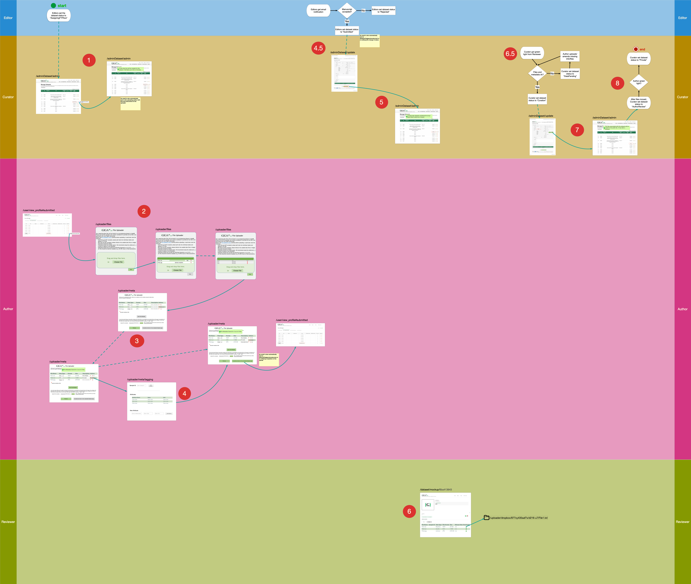

# GigaDB File Upload Wizard

Web application for authors to upload dataset of accepted papers, for reviewers to audit the uploaded dataset and for curators to publish the dataset to the public.

## How to start the GigaDB and File Upload Wizard webapps

A list of service used for File Upload Wizard are in the [Software Architecture](software_architecture.md) document.

### Preparation

For security reasons, inter-container communication is done through Docker Daemon API which use TCP port 2375 (2376 on staging and production).
However on macOS, Docker For Mac doesn't expose the API on a TCP port, so we need to use socat to expose the unix socket on port 2375.

on a separate terminal window/tab, run:
```
$ socat TCP-LISTEN:2375,reuseaddr,fork UNIX-CONNECT:/var/run/docker.sock &
```
socat can be installed with brew: ``brew install socat``

Alternatively, you can avoid local install of socat and run this docker command instead:
```
$ docker run -d -v /var/run/docker.sock:/var/run/docker.sock -p 127.0.0.1:2375:2375 bobrik/socat TCP-LISTEN:2375,fork UNIX-CONNECT:/var/run/docker.sock
```

**Note:** On Windows and Linux, it is not necessary to go through this step.

### Starting GigaDB, File Upload Wizard API (but not the prototype) from scratch

```
$ docker-compose run --rm config
$ docker-compose run --rm gigadb
$ docker-compose run --rm less
$ docker-compose run --rm fuw
$ docker-compose run --rm fuw-config
$ docker-compose up -d web
$ docker-compose exec web /usr/local/bin/enable_sites gigadb.dev.http fuw-backend.dev.http
```

### If GigaDB was already started, how to start the File Upload Wizard API

```
$ docker-compose run --rm fuw
$ docker-compose run --rm fuw-config
$ docker-compose exec web /usr/local/bin/enable_sites fuw-backend.dev.http
```

### Run database migrations

Make sure that both the ``fuw`` service (as Composer vendors libraries are required) and the ``fuw-config`` service (that fill in Database connection strings in config files) have been run beforehand.

Main database:
```
$ docker-compose exec console /app/yii migrate --interactive=0
```

Test database:

```
docker-compose exec -T console /app/yii_test migrate --interactive=0
```


### Start the prototype


First we need to create config file for the prototype:
```
$ docker-compose exec console bash -c "cd /app;./yii prototype/setup --appUrl http://gigadb.gigasciencejournal.com:9170"
```
Then, to start the prototype after having started the GigaDB and File Upload Wizard API as above:

```
$ docker-compose up -d fuw-proto
$ docker-compose exec web ash -c 'rm /etc/nginx/sites-enabled/gigadb.dev.http.conf'
$ docker-compose exec web /usr/local/bin/enable_sites gigadb-proto.dev.http
```

To stop and disable the prototype after it has been started:

```
$ docker-compose exec web ash -c 'rm /etc/nginx/sites-enabled/gigadb-proto.dev.http.conf'
$ docker-compose exec web /usr/local/bin/enable_sites gigadb.dev.http
$ docker-compose stop fuw-proto
```

The protototype will be availabe at:
[http://gigadb.gigasciencejournal.com:9170/proto/](http://gigadb.gigasciencejournal.com:9170/proto/)


## Testing

To run all the tests (GigaDB and FUW), these commands can be used:
```
$ ./tests/unit_runner
$ ./tests/functional_runner
$ ./tests/coverage_runner
$ ./tests/acceptance_runner local
```
See the [Developer Guide](developer_guide.md) for detailed information.


## Workflow

*right click and view image to zoom in*


