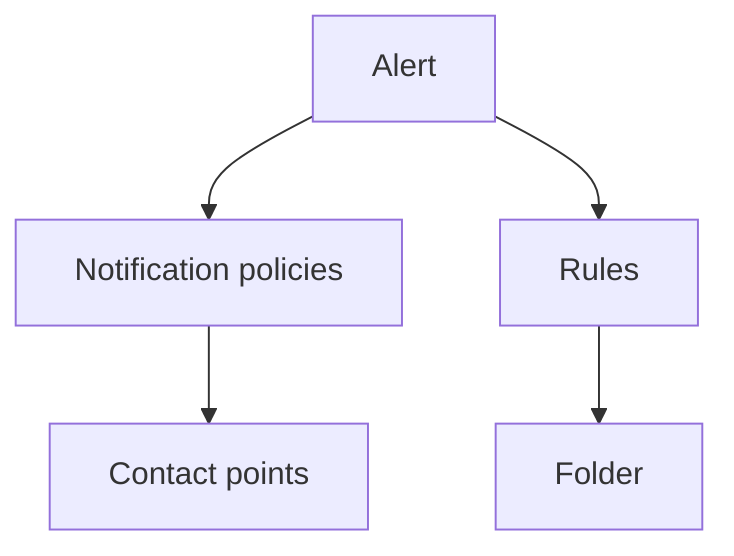

# Setting up monitoring infrastructure

Content:

* Deploy Node Exporter on web app and bastion EC2 instance
* Deploy Prometheus and Grafana on an existing remote Linux instance
* Setup a Node Exporter Grafana dashboard for all GigaDB EC2 instances
* Setup an email alert for low disk space for all GigaDB EC2 instances

## How-to

### Prerequisites

Deploy a VM running Debian 11 on a cloud service (doesn't matter which one for the scope of testing this PR)
Ensure:  
 * you have changed the security group/firewall to allow ingress to port 3000 from your IP only
 * you have changed the security group/firewall to allow ingress to port 9090 from your IP only
 * you have changed the security group/firewall to allow ingress to port 9100 from your IP only
 * you have changed the security group/firewall to allow ingress to port 22 from your IP only
 * you have changed the security group/firewall to allow ingress to port 9100 from `127.0.0.1/32`
 * you have generated a pair or public/private SSH keys to connect to that instance

### Preparing the Ansible playbook

First, add the following  variables filled in with correct value in your `.env` file at the root of `gigadb-website` project directory:

```
MONITORING_HOST=\<the public IP address of the remote linux instance\>
MONITORING_USER=\<the user on the remote linux instance that can do sudo\>
MONITORING_PRIVATE_KEY_LOCAL_PATH=\<path to the private ssh key on your local machine\>
```


Second, we need to install the Ansible roles we need:

```
$ cd ops/infrastructure/envs/staging/
$ ansible-galaxy install -r ../../../infrastructure/requirements.yml
```
Then we need ensure the playbooks and Ansible property are in the right place:

```
$ ../../../scripts/ansible_init.sh --env staging
```

### Running the playbook

```
$ env OBJC_DISABLE_INITIALIZE_FORK_SAFETY=YES ansible-playbook -i ../../inventories monitoring_playbook.yml
```

>Note: On macOS, don't forget the `OBJC_DISABLE_INITIALIZE_FORK_SAFETY` part, otherwise you will run into an error. This is documented in Ansible FAQ: https://docs.ansible.com/ansible/latest/reference_appendices/faq.html#running-on-macos-as-a-controller

>Note: you may be asked to validate the authenticity of the SSH connection, the first time
```
TASK [Gathering Facts] *****************************************************************************************************************************************************************************
The authenticity of host '43.198.90.158 (43.198.90.158)' can't be established.
ED25519 key fingerprint is SHA256:AuG661C4GMb33lRiRPpKbVbNIE0pTqgTFd8u8w8aiaI.
This key is not known by any other names
Are you sure you want to continue connecting (yes/no/[fingerprint])? yes
```


When finished successfully you should be able to navigate with your web browsers to:

 * Grafana server URL: http://\<MONITORING_HOST\>:3000 (use admin/admin as initial login/password, and for now, click "Skip" when asked to change)
 * Prometheus server URL: http://\<MONITORING_HOST\>:9090
 * Node exporter metrics URL: http://\<MONITORING_HOST\>:9100

### Final configuration step

The last step is to configure a target email address to receive alerts.
This is done manually by navigating to http://\<MONITORING_HOST\>:3000, then:
* click the hamburger menu
* click "Alerting"
* click "Contact points"

On the line whose "Contact point name" value is "grafana-default-email", click on the pencil under the "Actions" columns and change the email address to one you have access to, then click "Save".

### Testing that alerting works correctly

Choose a deployed AWS GigaDB environment you have access to amongst the ones that are green (up) marked on the Prometheus server, http://\<MONITORING_HOST\>:9090

>**Note**: beta.gigadb.org and staging.gigadb.org are always up and can be picked if you don't have a AWS deployment running for your fork.

#### Test the firing of the alert:

* ssh to the bastion server of the chosen environment
* run ``df -h`` and acknowledge the used space
* run ``fallocate -l 3G big_file`` and then run ``df -h`` again
* if the used space is not above 70 %, delete the fie we've just created and try again with `4G` instead of `3G`
* navigate to Grafana at http://\<MONITORING_HOST\>:3000
* go to `Home > Alerting >Alert rules
* expand the folder `gigadb-ec2-instances > regular`
* expand the `Disk Space Alert` rule and you should see a "firing" label on the selected environment 's bastion server


#### Test the resolution of the alert:

* ssh to the bastion server of the chosen environment
* run ``df -h`` and acknowledge the used space
* Used space should be above ``70%``
* Delete the big file we've created before with ``rm big_file``
* run ``df -h`` and acknowledge the used space
* Used space should be below ``70%``
* Navigate to Grafana
* go to `Home > Alerting >Alert rules
* expand the folder `gigadb-ec2-instances > regular`
* expand the `Disk Space Alert` rule and you should see a "normal" label on the selected environment's bastion server


#### Test that provisioning is idempotent:

Run the playbook a second time:

```
$ env OBJC_DISABLE_INITIALIZE_FORK_SAFETY=YES ansible-playbook -i ../../inventories monitoring_playbook.yml
```

The outcome should be successful and Grafana should be working as normal

## Explanation

### Prometheus

Prometheus is the core element for collecting operational metrics.
For our currenIt purpose, the system has two parts: a server software and metrics-collecting software agents called node exporters.


The node exporters need to be installed on every VMs whose hardware metrics we want to monitor.
In our case, it means ensuring node exporter installation is added to the provisioning of the Webapp and bastion EC2 instances in `webapp_playbook.yml` and `bastion_playbook.yml` respectively.
The server part will be deployed on its own VM. So we have a new playbook for that, `monitoring_playbook.yml`.
Because we also need to monitor the hardware resource of that VM as well, node exporter provisioning is also added to that playbook.

There is a community Ansible collection of roles we can use to deploy Prometheus component:

* `prometheus.prometheus`: https://prometheus-community.github.io/ansible/branch/main/index.html

In order to use that collection, we can amend `ops/infrastructure/requirements.yml` with a reference in the collection section: 

```
collections:
  - source: https://galaxy.ansible.com
    name: prometheus.prometheus

```

Then in the playbook we add two plays titled "Install Node exporter" and "Install Prometheus".
The former is straightforward and is identical to the play we have added to the `webapp_playbook.yml` and `bastion_playbook.yml` playbooks already.
The latter is more involved as it's the one that install and configure Prometheus so that it an automatically discover all  EC2 instances in our infrastructure.

The prerequisite here was to create a new AWS IAM user `Prometheus` with readonly access to all EC2 related objects.
The access key and private token for this user are stored on Gitlab variables (using `ansible_init.sh` to expose them to the playbook). It will be used by Prometheus to discover EC2 instances in the regions we are instantiating EC2s. 
The `ec2_sd_configs` section of the Ansible play is written to allow that.
The `relabel_configs` section is here to: 
 * work around the fact that the EC2 discovery mechanism expose the private IP by default but can't use that as the Prometheus server is not necessarily in the same VPC (or cloud service of that matter) so we need to use public IP instead. 
 * Also we want to exclude the instance where the monitoring server is as we have static config for that.
Finally we need add static config `static_configs` to add monitored node for Prometheus server itself and its local node exporter.

### Grafana

The rest of the plays in `monitoring_playbook.yml` are for deploying and configuring Grafana.
I found three Ansible collection and roles available from the community or officially.

* `ansible-grafana`: https://github.com/atosatto/ansible-grafana
* `community.grafana`: https://docs.ansible.com/ansible/latest/collections/community/grafana/index.html
* `grafana.grafana`: https://docs.ansible.com/ansible/latest/collections/grafana/grafana/index.html

 
Unfortunately, unlike for Prometheus, we cannot just pick one, we need to mix and match them as their capability and feature compatibility vary. Even then, we also still need to hand craft steps that interact with the API as the only collection (`grafana.grafana`) that has support for the alerting provisioning we want only work with Grafana Cloud (we are self-hosting).

The first thing to do is to install Grafana, which can be done easily with the `ansible-grafana` role.
It's important to configure the email sending at this stage so the new Grafana install can send email alerts.
Those settings comes from Gitlab variables (using `ansible_init.sh` to expose them to the playbook)

In order to interact with Grafana API, we need an API key.
So the next play is to actually install Grafana server (and configure email sending) and then create an API key.
The former is straightforward are we can just use the `ansible-grafana` role.
The later is a bit more involved because the REST API is not idempotent.

The endpoints involved to create API keys are documented here:
* https://grafana.com/docs/grafana/latest/developers/http_api/auth/

The remaining plays are for Configuring Grafana.
First, we configure the datasource so that Grafana can make use of the metrics collected by Promotheus. This is straightforwardly done using the `grafana_datasource` from the `community.grafana.grafana` role.
The `uid:` parameters is actually meaningful as it must match the value we have hard-coded in the `gigascience-node-exporter-dashboard.json` dashboard (see below).

Then we need to copy the Node exporter dashboard configuration file (JSON) we have in our codebase to the monitoring server.
We proceed this way because if we had let the `community.grafana.grafana`'s `grafana_dashboard` role pull the dashboard from the Grafana dashboard store on `grafana.com`, we would get an error whereby Grafana cannot find the data source.
So instead I've downloaded the configuration file and hard-coded the data-source mentioned above in the file and then the role will use the server path to load the dashboard.
In summary, after copying the configuration file to the server, we have a step implementing `grafana_dashboard` with the `path:` parameter referencing server path to the configuration file (instead of using the `dashboard_id` parameter that expects a dashboard ID from `grafana.com`)

The next couple of plays are for configuring our team email in the default contact point.
It has two stages because it's done with the API, and PUTting the email address to the API endpoint for contact point requires knowing the `uid` for that contact point object which we don't yet, so the stages are:
* Get the contact point object  called "grafana-default-email" (which is created when Grafana is installed) and capture the `uid`
* Put to the contact point endpoint keyed by the `uid`, a JSON payload (in our codebase as `grafana-contact-points.json`) containing our email address.

The documentation for this API is actually in the Alerting section: 
* https://grafana.com/docs/grafana/latest/developers/http_api/alerting_provisioning/

That's because contact point is one of the key pillars for alerting to work:



For now, we don't need to do anything for the notification policies as the default one will work for us (it make use of the default contract point), so the remainder of the plays are to configure the rules. As shown in the diagram, the rules need to be organised inside folders, so we need to create a folder first. Fortunately, the `community.grafana` collection has a module for that, `community.grafana.grafana_folder` which is straightforward to use.

Finally, we can create a rule. None of the public Grafana roles can do that on a self-hosted installation, so we need to use the API.
Creating a rule is a HTTP POST on a REST API endpoint, se we will have the same problem as for the API key: 
* create the rule and detect the response code
* If the response code is 500, it's likely the rule exists already, so download the list of rules
* delete matching existing rule if original response code was 500
* create the rule again if original response code was 500

When creating a new rule, we need to supply a JSON payload which is in our codebase as `gigadb-disk-alert-rule.j2`.
That file's content was obtained by exporting with `curl` the alert rule I've created manually in the UI, and removing the `uid:` key from it.


```
curl --request GET --header 'Authorization: Bearer \<API KEY HERE\>' --header 'Content-Type: application/json; charset=utf-8' http://\<MONITORING_HOST\>:3000/api/v1/provisioning/alert-r`ules/bd5b8e4a-400c-4144-abb9-e8aa2fce10a3 | jq > ~/Downloads/gigadb-disk-alert-rule.json
```

Note that that file is a Jinja2 (`.j2`) template because we need to replace the `folderUID` key with the UID of the folder we have provisioned in the previous step.
