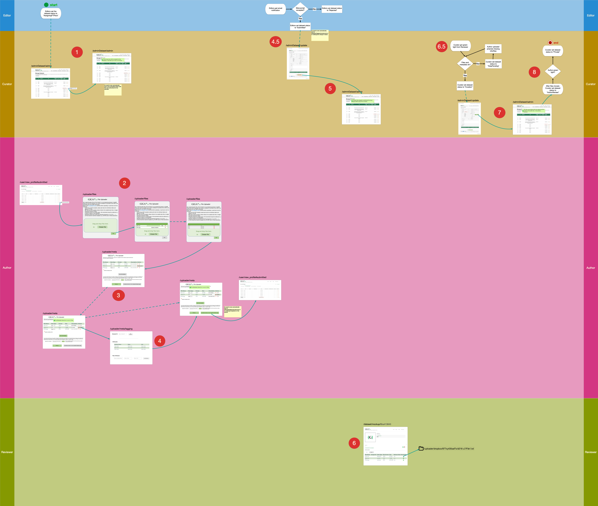

# GigaDB File Upload Wizard

Web application for authors to upload dataset of accepted papers, for reviewers to audit the uploaded dataset and for curators to publish the dataset to the public.

## Start the prototype

```
./yii prototype/setup --protoUrl http://fuw-proto-dev.pommetab.com:9170/ --apiUrl http://fuw-admin-api/filedrop-accounts --tusUrl http://fuw-proto-dev.pommetab.com:9170/files/
```
## Workflow

