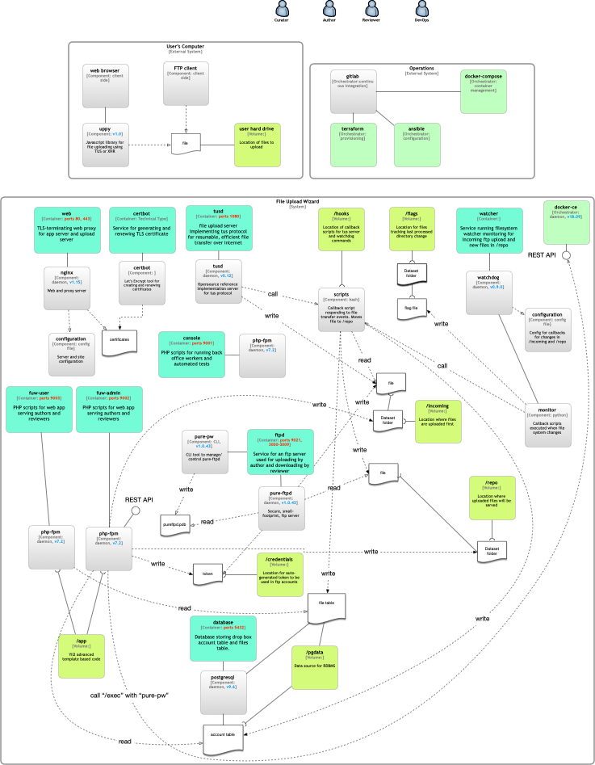

# Software Architecture for File Upload Wizard

## Architecture

## Systems Components

### Web Server

The web server is shared by all web apps, Gigadb and File Upload Wizard.
It also acts as a termination for TLS for the web apps, as well as to the TUS server.
The server software is Nginx opensource running on Alpine Linux.

The docker-compose service for the container is called "web"

### Database Server

The web server is shared by all web apps, Gigadb and File Upload Wizard.
PostgresQL 9.6 is used on non-production environment. It also run on Alpine Linux.

### TUS File server

The method for users to upload their files is to use the File Upload Wizard form that use a javascript library (Uppy) that provide upload UX and client to send the files over Internet to a server implementing the TUS transport protocol.

On the same Docker host that run gigadb website containers, we use a container running the tusd, the official reference implementation of a TUS server. It will exposes the port 1080 and the Uppy javascript client must be configured with its address and port.

In production, the tusd will be fronted by a TLS termination proxy (implemented in the nginx web server container) so the file transfers are encrypted.

The docker-compose service for this container is called "tusd".
The image used is the official image: (https://hub.docker.com/r/tusproject/tusd)

More about tusd: [tusd](https://github.com/tus/tusd)

More about Uppy: [uppy](https://uppy.io/docs/)

### FTP Server

For some users, the form-based file upload cannot works because of web browsers incompatibility or corporate firewall policy.
They can use FTP to upload the files. We use a container running pure-ftpd which is lightweight, easily configurable and very-secure.

FTP is also the method for exposing the links allowing reviewers to download files to assess.

Therefore for each File Upload Wizard Filedrop account, there are two ftp account, one for uploading, the other for downloading. the authorization token is different for each FTP account.

The image is built from our Dockerfile in `fuw/docker-pure-ftpd`, based on its most popular docker image: (https://github.com/stilliard/docker-pure-ftpd)

The docker-service for this container is called "ftpd".

More about ftpd: [pure-ftpd](https://www.pureftpd.org/project/pure-ftpd/)

### Hooks, watcher and files management

There is a file pipeline that kicks off server-side as soon as a file has finished uploading.

Depending on the upload method used (tus or ftp), the uploaded file is moved using post-upload hook (tus) or file-system watching (ftp). The aim being move the files in a common area from which they can then be stored, served and eventually synchronised (to public ftp server on CNGB).

The tusd hooks uses its hooks feature: [tusd hooks](https://github.com/tus/tusd/blob/master/docs/hooks.md).

For the ftp uploads, we watches the filesystem using linux inotify command.
We use a container that run linux inotify and a python daemon to execute configured commands upon file change.

The image for this container is custom built and is in ``fuw/docker-inotify-command``. It is based on third party image: (https://github.com/coppit/docker-inotify-command).

The commands to execute for tusd hooks and FTP watcher commands are located in the same directory ``fuw/hooks``.

### GigaDB Webapp

The main web site that serve dataset files and their metadata.
It's built with Yii 1 framework (but it can be coded with Yii2 code).
The web application is fronted by the nginx web and TLS termination server container and it runs inside a php-fpm/php 7.1 container using official Debian Stretch (8) based image.

The automated testing for this webapp make use of three other containers, test container, phantomJS container and a PosgreSQL server container.

The docker-compose service for this container is called "application", while that of the side-car (auxiliary) services mentioned above are "test", "phantomjs" and "database" respectively.

The "test" and "application" service are built from the same Dockerfile, but they are parametized differenlty using arguments set in the docker-compose files that enable/disable corresponding argument flags in the Dockerfile. The "test" services has debugging, testing and console related flags switched on that the "application" have switched off.

#### test

We use this container service to run all tests (unit, functional and acceptance) for the Gigadb webapp, and also for debugging as it has a bash console.

#### phantomjs

This service runs a PhantomJS WebKit headless browser to execute the acceptance tests scenarios against a concrete deployment of GigaDB webapp.

#### database

This container service run a PostgreSQL server which is the database server used by all webapps (GigaDB and File Upload Wizard).

A database serves a single webapp's functions and storage need so each webapp has it's own database on the server. The database objects are stored in the default "public" schema of each database.

The container service called "database" is the official PostgreSQL's Alpine Linux variant. Custom initialiation scripts have been setup to configure password-less access to GigaDB database to all services on the same virtual network as the database (which excludes public web facing servers), and to initialise the database with a schema, reference data on brand new deployments for both test and regular database.

### File Upload Wizard Webapps

The user-visible web application for authors to upload, reviewers to audit and curators to administrate the files associated to a newly accepted manuscript. It is built on Yii 2 web framework using Yii2 Advanced project template. It consists of three components or services, each running in their own php-fpm container.
There is only one Dockerfile for the "console" and "fuw-admin". However the build is parametized using boolean arguments switched on and off in the docker-compose files "args" section that in turn switch on or off the corresponding arguments flags in the Dockerfile.

Eventually the "fuw-user" front-end component which contains the actual file upload forms will use the same parametized Dockerfile, but it's not the case yet as fuw-user is still a dummy or scaffolding for now.

File Upload Wizard components use the same database server service as the Gigadb Webapp, but has one distinct database with a schema that serves the workflow of its three components.

#### fuw-admin

In Yii2 terminology, this is the backend application. Intended only for admin task, in our case curator's tasks. Because the workflow for curator is triggered using UX in Gigadb Webapp, fuw-admin can be built as a only a REST API to receive commands from Gigadb Webapp.

The API is scaffolded using the Yii REST controllers library, and the testing relies on the Yii2 and REST modules of the Codeception testing framework.

#### console

The "console" service is similar in role for File Upload Wizard to the "test" service in the GigaDB webapp: used for running tests, command-line experiments and debugging.

And additional role is to run back-office workers (implemented as Yii2  console controllers).

The script to configure and start the prototype also can be found there as the Yii2 console controller "PrototypeController".

#### fuw-user

Not yet built, just the scaffolding.
The user accessible (UX) component of the File Upload Wizard webapp.

In the Yii2 Advanced Template application architecture, this is the "frontend" application.

### Certificate management

TLS termination is provided in the "web" container service, using TLS certificates from Let's Encrypt implemented in Nginx.

In addition of encrypting web traffic to GigaDB and FUW webapps, it encrypt traffic to  the TUS daemon in "tusd" container service.

Valid 3 months, the renewal process is performed automatically upon deployment to staging/production environment.

For development environment we are using the minica project to create and manage self-signed certifcate on development machine, the CA keys of which needs to be added in the web browsers (at least for Firefox) in order to be supported.

### Console and testing

### Networking

There are two Docker networks, the "web-tier" and "db-tier", to avoid exposing back-office applications to the open web.

